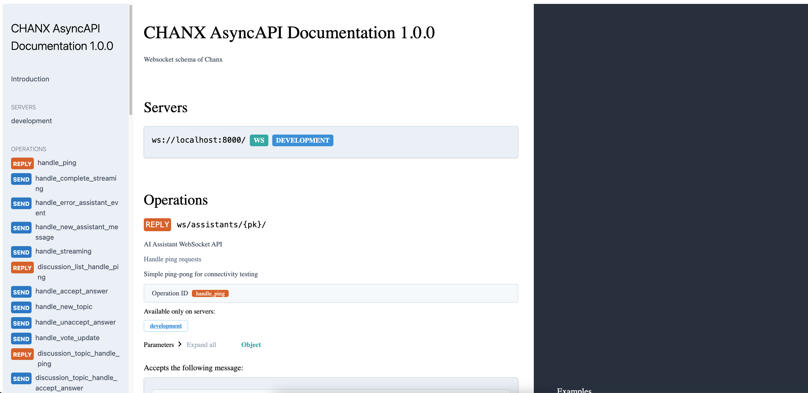

Introduction
============

What is Chanx?
--------------
Chanx is a batteries-included WebSocket framework for Django Channels, FastAPI, and ASGI-compatible applications. It provides automatic message routing, Pydantic validation, type safety, AsyncAPI documentation generation, and comprehensive testing utilities out of the box.

Built on years of real-world WebSocket development experience, Chanx provides proven patterns that help teams build maintainable, type-safe WebSocket applications with less code and better developer experience.

The Problem
-----------

**Django Channels: Too Much Manual Work**

Django Channels provides WebSocket support but leaves critical functionality to you:

- Writing endless if-else chains to route messages
- Manually parsing and validating every incoming message
- Repeating boilerplate for authentication and broadcasting
- No automatic API documentation
- Limited type safety - runtime errors are common

**FastAPI: Missing Core Features**

FastAPI's WebSocket support is even more basic:

- No channel layers for broadcasting
- No group management - you track connections manually
- No built-in message routing
- No event system to trigger messages from other app parts

**The Team Collaboration Nightmare**

These gaps create serious problems when working with teams:

.. code-block:: python

    # Each developer implements routing differently
    # Developer A:
    async def receive(self, text_data):
        data = json.loads(text_data)
        if data["action"] == "chat":
            await self.handle_chat(data["message"])

    # Developer B:
    async def receive(self, text_data):
        msg = json.loads(text_data)
        action = msg.get("action")
        if action == "chat":
            if "payload" not in msg:
                return
            await self.process_chat(msg["payload"])

    # Different patterns, no consistency, bugs everywhere

This leads to:

- **Painful code reviews**: Reviewing 200+ line if-else chains is tedious and error-prone
- **Slow onboarding**: New developers spend days reading code to understand what messages exist
- **No API contract**: Frontend asks "what messages can I send?" - no one knows for sure
- **Broken documentation**: Manually written docs are outdated within weeks
- **Debugging hell**: No structured logging makes tracing errors through WebSocket flows painful
- **Fragile tests**: Each developer writes different test patterns, CI breaks often

How Chanx Solves This
----------------------

**1. Automatic Routing & Validation - No More If-Else Hell**

.. code-block:: python

    # Before: Manual routing nightmare
    async def receive(self, text_data):
        data = json.loads(text_data)
        action = data.get("action")

        if action == "chat":
            if "message" not in data.get("payload", {}):
                await self.send(json.dumps({"error": "Missing message"}))
                return
            # Handle chat...
        elif action == "ping":
            await self.send(json.dumps({"action": "pong"}))
        # ... 50+ more elif statements

    # After: Clean, automatic routing
    from chanx.core.decorators import ws_handler, channel

    @channel(name="chat", description="Real-time chat")
    class ChatConsumer(AsyncJsonWebsocketConsumer):
        @ws_handler(output_type=ChatNotificationMessage)
        async def handle_chat(self, message: ChatMessage) -> None:
            # Automatically routed, validated, and type-safe
            await self.broadcast_message(
                ChatNotificationMessage(payload=message.payload)
            )

        @ws_handler
        async def handle_ping(self, message: PingMessage) -> PongMessage:
            return PongMessage()

**2. Complete Type Safety - Catch Errors During Development**

.. code-block:: python

    from typing import Literal
    from pydantic import BaseModel
    from chanx.messages.base import BaseMessage

    class ChatPayload(BaseModel):
        message: str

    class ChatMessage(BaseMessage):
        action: Literal["chat"] = "chat"
        payload: ChatPayload

    # ✅ IDE autocomplete works
    # ✅ mypy/pyright catches type errors
    # ✅ Pydantic validates at runtime
    # ✅ Framework auto-generates discriminated unions

**3. Auto-Generated Documentation & Type-Safe Clients**

.. code-block:: python

    @ws_handler(
        summary="Send chat message",
        description="Broadcast message to all room members",
        tags=["chat"]
    )
    async def handle_chat(self, message: ChatMessage) -> None:
        # AsyncAPI 3.0 spec generated automatically
        # Interactive docs at /asyncapi/
        # Frontend knows exactly what to send

**Generate Type-Safe Python Clients**

.. code-block:: bash

    # Generate from local file or URL (JSON/YAML supported)
    chanx generate-client --schema asyncapi.json --output ./my_client
    chanx generate-client --schema http://localhost:8000/asyncapi.json --output ./my_client

.. code-block:: python

    # Use generated client with full type safety
    from my_client.chat import ChatClient, ChatMessage, ChatPayload

    client = ChatClient("localhost:8000")
    await client.send_message(
        ChatMessage(payload=ChatPayload(message="Hello!"))
    )

See :doc:`user-guide/client-generator` for complete client generation guide.

**4. Multi-Framework Support - Works Everywhere**

.. code-block:: python

    # Django Channels - full support
    from chanx.channels.websocket import AsyncJsonWebsocketConsumer

    # FastAPI - adds channel layers, broadcasting, groups
    from chanx.fast_channels.websocket import AsyncJsonWebsocketConsumer

    # Same decorators, same API, same features

**5. Event Broadcasting - Trigger Messages from Anywhere**

.. code-block:: python

    # From Django view
    def create_post(request):
        post = Post.objects.create(...)
        ChatConsumer.broadcast_event_sync(
            NewPostEvent(payload={"title": post.title}),
            groups=["feed_updates"]
        )
        return JsonResponse({"status": "created"})

    # From Celery task
    @celery.task
    def process_payment(payment_id):
        payment = process_payment_logic(payment_id)
        PaymentConsumer.send_event_sync(
            PaymentCompleteEvent(payload=payment.to_dict()),
            channel_name=f"user_{payment.user_id}"
        )

**6. Comprehensive Testing - Fast, Reliable, Easy**

.. code-block:: python

    # FastAPI/ASGI
    from chanx.fast_channels.testing import WebsocketCommunicator

    async def test_chat():
        async with WebsocketCommunicator(
            app, "/ws/chat", consumer=ChatConsumer
        ) as comm:
            await comm.send_message(ChatMessage(payload="Hello"))
            messages = await comm.receive_all_messages(
                stop_action=GROUP_ACTION_COMPLETE
            )
            assert messages[0].action == "chat_notification"

    # Django Channels
    from chanx.channels.testing import WebsocketTestCase

    class TestChat(WebsocketTestCase):
        consumer = ChatConsumer

        async def test_broadcast(self):
            await self.auth_communicator.connect()
            await ChatConsumer.broadcast_event(
                StreamingEvent(payload=data),
                groups=[f"user_{self.user.pk}"]
            )
            messages = await self.auth_communicator.receive_all_messages(
                stop_action=EVENT_ACTION_COMPLETE
            )

What You Get
------------

**Better Developer Experience**
  - Write less code - decorators replace hundreds of lines of routing
  - IDE autocomplete and type checking - catch errors before runtime
  - Consistent patterns across the team - everyone uses the same decorators
  - Fast onboarding - new developers see ``@ws_handler`` and immediately understand

**Better App Flow**
  - Automatic message routing based on ``action`` field discriminator
  - Type-safe validation with Pydantic - invalid messages rejected automatically
  - Event broadcasting from anywhere - HTTP views, Celery tasks, management scripts
  - Structured logging - trace every message through the system

**Better Documentation**
  - Auto-generated AsyncAPI 3.0 specs from your code
  - Interactive documentation at ``/asyncapi/``
  - Always up-to-date - docs generated from actual implementation
  - Frontend knows exactly what messages to send

**Better Testing**
  - Framework-specific test utilities
  - Type-safe message sending/receiving
  - ``receive_all_messages()`` with stop actions for reliable testing
  - Comprehensive test coverage becomes easy

**Safer Production**
  - Static type checking with mypy/pyright
  - Runtime validation with Pydantic
  - Structured error logging for easier debugging
  - Proven patterns from years of real-world use

Who Should Use Chanx?
----------------------
Chanx is ideal for:

- **Teams** building WebSocket features who want consistent patterns and less code review pain
- **Python developers** building real-time features across any ASGI framework
- **Django projects** wanting to eliminate WebSocket boilerplate and maintain REST API consistency
- **FastAPI projects** needing robust WebSocket capabilities with channel layers, broadcasting, and automatic documentation
- **Full-stack applications** requiring seamless event broadcasting between HTTP and WebSocket layers
- **Type-safety advocates** who want comprehensive mypy/pyright support for WebSocket development
- **API-first teams** who need automatic AsyncAPI documentation generation

Next Steps
----------
- :doc:`installation` - Install and configure Chanx in your project
- :doc:`quick-start-django` - Build your first Django WebSocket endpoint
- :doc:`quick-start-fastapi` - Build your first FastAPI WebSocket endpoint
- :doc:`user-guide/prerequisites` - Start with the user guide prerequisites
