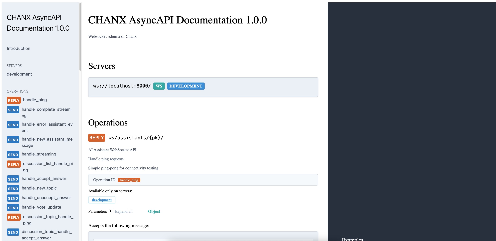

Django Quick Start
==================

This guide shows you how to get started with Chanx in Django with Django Channels.

Prerequisites
-------------

Install Chanx with Django Channels support:

.. code-block:: bash

    pip install "chanx[channels]"

This installs Django, Django Channels, Django REST Framework, and Channels Redis.

Project Setup
-------------

1. **Configure ASGI and WebSocket Routing**

Create ``myproject/asgi.py``:

.. code-block:: python

    import os
    from channels.routing import ProtocolTypeRouter
    from channels.security.websocket import OriginValidator
    from channels.sessions import CookieMiddleware
    from django.core.asgi import get_asgi_application
    from chanx.channels.routing import include

    os.environ.setdefault("DJANGO_SETTINGS_MODULE", "myproject.settings")
    django_asgi_app = get_asgi_application()

    application = ProtocolTypeRouter({
        "http": django_asgi_app,
        "websocket": CookieMiddleware(include("myproject.routing")),
    })

2. **Create WebSocket Routing**

Create ``myproject/routing.py``:

.. code-block:: python

    from channels.routing import URLRouter
    from chanx.channels.routing import path
    from myapp.consumers import ChatConsumer

    router = URLRouter([
        path("ws/chat/", ChatConsumer.as_asgi()),
    ])

3. **Configure Django Settings**

Add to your ``settings.py``:

.. code-block:: python

    INSTALLED_APPS = [
        'daphne',  # Only needed if using 'python manage.py runserver'
        # ... your apps
        'channels',
        'rest_framework',
        'chanx.channels',
    ]

    # WebSocket settings
    ASGI_APPLICATION = 'myproject.asgi.application'
    CHANNEL_LAYERS = {
        'default': {
            'BACKEND': 'channels_redis.core.RedisChannelLayer',
            'CONFIG': {
                "hosts": [('127.0.0.1', 6379)],
            },
        },
    }

    # Chanx configuration
    CHANX = {
        "CAMELIZE": True,
        "SEND_COMPLETION": False,
        "LOG_WEBSOCKET_MESSAGE": True,
        "ASYNCAPI_TITLE": "My WebSocket API",
        "ASYNCAPI_DESCRIPTION": "WebSocket API documentation",
    }

4. **Add AsyncAPI Documentation URLs**

Add to your ``urls.py``:

.. code-block:: python

    from django.urls import path, include

    urlpatterns = [
        # ... your URLs
        path('asyncapi/', include('chanx.channels.urls')),
    ]

Create a Simple Consumer
------------------------

1. **Define Message Types**

Create ``myapp/messages.py``:

.. code-block:: python

    from typing import Literal
    from pydantic import BaseModel
    from chanx.messages.base import BaseMessage

    # Payloads
    class EchoPayload(BaseModel):
        message: str

    class NotificationPayload(BaseModel):
        alert: str
        level: str = "info"

    # Client Messages
    class EchoMessage(BaseMessage):
        action: Literal["echo"] = "echo"
        payload: EchoPayload

    # Server Messages
    class EchoResponseMessage(BaseMessage):
        action: Literal["echo_response"] = "echo_response"
        payload: EchoPayload

    class NotificationMessage(BaseMessage):
        action: Literal["notification"] = "notification"
        payload: NotificationPayload

    # Events (for server-side broadcasting)
    class SystemNotifyEvent(BaseMessage):
        action: Literal["system_notify"] = "system_notify"
        payload: NotificationPayload

2. **Create the Consumer**

Create ``myapp/consumers.py``:

.. code-block:: python

    from chanx.core.decorators import ws_handler, event_handler, channel
    from chanx.channels.websocket import AsyncJsonWebsocketConsumer
    from chanx.messages.incoming import PingMessage
    from chanx.messages.outgoing import PongMessage
    from .messages import (
        EchoMessage, EchoResponseMessage, NotificationMessage,
        SystemNotifyEvent, EchoPayload, NotificationPayload
    )

    @channel(name="chat", description="Simple chat and echo system", tags=["demo"])
    class ChatConsumer(AsyncJsonWebsocketConsumer[SystemNotifyEvent]):
        groups = ["general_chat"]  # Auto-join this group

        @ws_handler(summary="Handle ping requests")
        async def handle_ping(self, message: PingMessage) -> PongMessage:
            return PongMessage()

        @ws_handler(
            summary="Echo messages back to sender",
            description="Returns the same message with a prefix",
        )
        async def handle_echo(self, message: EchoMessage) -> EchoResponseMessage:
            return EchoResponseMessage(
                payload=EchoPayload(message=f"Echo: {message.payload.message}")
            )

        @ws_handler(
            summary="Broadcast message to all connected clients",
            output_type=NotificationMessage,
        )
        async def handle_broadcast(self, message: EchoMessage) -> None:
            # Broadcast to all clients in the group
            await self.broadcast_message(
                NotificationMessage(
                    payload=NotificationPayload(
                        alert=f"Broadcast: {message.payload.message}",
                        level="info"
                    )
                )
            )

        @event_handler
        async def handle_system_notify(self, event: SystemNotifyEvent) -> NotificationMessage:
            """Handle system notifications from background tasks."""
            return NotificationMessage(payload=event.payload)

3. **Run the Server**

**Option 1: Using Django's runserver** (requires ``daphne`` in INSTALLED_APPS):

.. code-block:: bash

    python manage.py runserver

**Option 2: Using Uvicorn directly** (no ``daphne`` needed in INSTALLED_APPS):

.. code-block:: bash

    uvicorn myproject.asgi:application

Visit ``http://localhost:8000/asyncapi/docs/`` to see the auto-generated documentation.

Test with JavaScript in the browser console:

.. code-block:: javascript

    // Connect to WebSocket
    const ws = new WebSocket('ws://localhost:8000/ws/chat/');

    ws.onmessage = (event) => {
        console.log('Received:', JSON.parse(event.data));
    };

    // Test ping
    ws.send(JSON.stringify({"action": "ping"}));

    // Test echo
    ws.send(JSON.stringify({
        "action": "echo",
        "payload": {"message": "Hello World"}
    }));

    // Test broadcast (all connected clients will receive this)
    ws.send(JSON.stringify({
        "action": "broadcast",
        "payload": {"message": "Hello everyone!"}
    }));

4. **Send Events from Anywhere**

You can send events to WebSocket clients from Django views, Celery tasks, etc:

.. code-block:: python

    # From a Django view
    from myapp.consumers import ChatConsumer
    from myapp.messages import SystemNotifyEvent, NotificationPayload

    def some_view(request):
        # Send notification to all connected clients
        ChatConsumer.broadcast_event_sync(
            SystemNotifyEvent(
                payload=NotificationPayload(
                    alert="Server maintenance in 5 minutes",
                    level="warning"
                )
            ),
            groups=["general_chat"]
        )
        return JsonResponse({"status": "notification sent"})

Next Steps
----------

Now that you have a working Django WebSocket consumer with Chanx:

**Tutorial:**

* :doc:`tutorial-django/prerequisites` - **Follow the comprehensive Django tutorial** to build a complete real-time application with chat, AI assistants, background tasks, and testing

**Documentation:**

* :doc:`user-guide/consumers-decorators` - Learn more about consumers and decorators
* :doc:`user-guide/framework-integration` - Explore Django-specific features
* :doc:`user-guide/asyncapi` - Learn about AsyncAPI documentation generation
* :doc:`user-guide/testing` - Learn about testing your WebSocket consumers
* :doc:`examples/django` - See complete Django implementation examples
* :doc:`quick-start-fastapi` - Try Chanx with FastAPI
