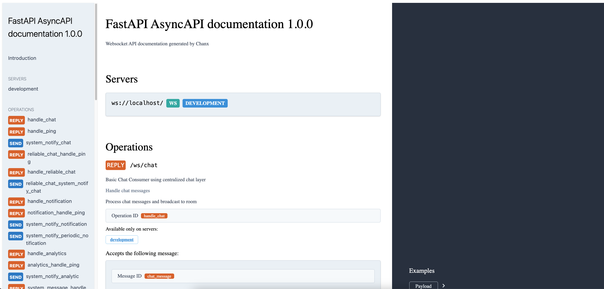

FastAPI Quick Start
===================

This guide shows you how to get started with Chanx in FastAPI.

Prerequisites
-------------

Install Chanx with FastAPI support:

.. code-block:: bash

    pip install "chanx[fast_channels]"

This installs FastAPI and fast-channels.

Project Setup
-------------

1. **Create Base Consumer Configuration**

Create ``base_consumer.py``:

.. code-block:: python

    from chanx.fast_channels.websocket import AsyncJsonWebsocketConsumer

    class BaseConsumer(AsyncJsonWebsocketConsumer):
        # Message configuration
        send_completion = False
        log_websocket_message = True
        camelize = False

        # Required: Channel layer alias for non-Django frameworks
        channel_layer_alias = "default"

2. **Configure Channel Layers**

Create ``layers.py``:

.. code-block:: python

    import os
    from fast_channels.layers import (
        InMemoryChannelLayer,
        has_layers,
        register_channel_layer,
    )
    from fast_channels.layers.redis import RedisChannelLayer

    def setup_channel_layers():
        """Set up and register channel layers for the application."""
        if has_layers():
            return

        redis_url = os.getenv("REDIS_URL", "redis://localhost:6379")

        # Register the default channel layer
        register_channel_layer(
            "default",
            RedisChannelLayer(hosts=[redis_url])
        )

        # Optional: Add more layers for different purposes
        # register_channel_layer("memory", InMemoryChannelLayer())

3. **Create FastAPI Application**

Create ``main.py``:

.. code-block:: python

    from fastapi import FastAPI
    from fastapi.requests import Request
    from fastapi.responses import HTMLResponse, JSONResponse, Response
    from chanx.fast_channels import (
        asyncapi_docs,
        asyncapi_spec_json,
        asyncapi_spec_yaml,
    )
    from chanx.fast_channels.type_defs import AsyncAPIConfig
    from layers import setup_channel_layers
    from consumers import ChatConsumer

    # Setup channel layers
    setup_channel_layers()

    app = FastAPI()

    # AsyncAPI configuration
    asyncapi_config = AsyncAPIConfig(
        title="My FastAPI WebSocket API",
        description="WebSocket API with Chanx",
        version="1.0.0",
    )

    # Add AsyncAPI documentation routes
    @app.get("/asyncapi")
    async def asyncapi_documentation(request: Request) -> HTMLResponse:
        return await asyncapi_docs(request=request, app=app, config=asyncapi_config)

    @app.get("/asyncapi.json")
    async def asyncapi_json_spec(request: Request) -> JSONResponse:
        return await asyncapi_spec_json(request=request, app=app, config=asyncapi_config)

    @app.get("/asyncapi.yaml")
    async def asyncapi_yaml_spec(request: Request) -> Response:
        return await asyncapi_spec_yaml(request=request, app=app, config=asyncapi_config)

    @app.get("/")
    async def root():
        return {"message": "WebSocket server running"}

    # WebSocket routes
    app.add_websocket_route("/ws/chat", ChatConsumer.as_asgi())

Create a Simple Consumer
------------------------

1. **Define Message Types**

Create ``messages.py``:

.. code-block:: python

    from typing import Literal
    from pydantic import BaseModel
    from chanx.messages.base import BaseMessage

    # Payloads
    class EchoPayload(BaseModel):
        message: str

    class NotificationPayload(BaseModel):
        alert: str
        level: str = "info"

    # Client Messages
    class EchoMessage(BaseMessage):
        action: Literal["echo"] = "echo"
        payload: EchoPayload

    # Server Messages
    class EchoResponseMessage(BaseMessage):
        action: Literal["echo_response"] = "echo_response"
        payload: EchoPayload

    class NotificationMessage(BaseMessage):
        action: Literal["notification"] = "notification"
        payload: NotificationPayload

    # Events (for server-side broadcasting)
    class SystemNotifyEvent(BaseMessage):
        action: Literal["system_notify"] = "system_notify"
        payload: NotificationPayload

2. **Create the Consumer**

Create ``consumers.py``:

.. code-block:: python

    from chanx.core.decorators import ws_handler, event_handler, channel
    from chanx.messages.incoming import PingMessage
    from chanx.messages.outgoing import PongMessage
    from base_consumer import BaseConsumer
    from messages import (
        EchoMessage, EchoResponseMessage, NotificationMessage,
        SystemNotifyEvent, EchoPayload, NotificationPayload
    )

    @channel(name="chat", description="Simple chat and echo system", tags=["demo"])
    class ChatConsumer(BaseConsumer):
        groups = ["general_chat"]

        @ws_handler(summary="Handle ping requests")
        async def handle_ping(self, message: PingMessage) -> PongMessage:
            return PongMessage()

        @ws_handler(summary="Echo messages back")
        async def handle_echo(self, message: EchoMessage) -> EchoResponseMessage:
            return EchoResponseMessage(
                payload=EchoPayload(message=f"Echo: {message.payload.message}")
            )

        @ws_handler(
            summary="Broadcast message to all clients",
            output_type=NotificationMessage,
        )
        async def handle_broadcast(self, message: EchoMessage) -> None:
            await self.broadcast_message(
                NotificationMessage(
                    payload=NotificationPayload(
                        alert=f"Broadcast: {message.payload.message}",
                        level="info"
                    )
                )
            )

        @event_handler
        async def handle_system_notify(self, event: SystemNotifyEvent) -> NotificationMessage:
            return NotificationMessage(payload=event.payload)

3. **Run the Application**

.. code-block:: bash

    uvicorn main:app --reload

Visit ``http://localhost:8000/asyncapi`` to see the auto-generated documentation.

4. **Test the Consumer**

Test with JavaScript in the browser console:

.. code-block:: javascript

    // Connect to WebSocket
    const ws = new WebSocket('ws://localhost:8000/ws/chat');

    ws.onmessage = (event) => {
        console.log('Received:', JSON.parse(event.data));
    };

    // Test ping
    ws.send(JSON.stringify({"action": "ping"}));

    // Test echo
    ws.send(JSON.stringify({
        "action": "echo",
        "payload": {"message": "Hello World"}
    }));

    // Test broadcast (all connected clients will receive this)
    ws.send(JSON.stringify({
        "action": "broadcast",
        "payload": {"message": "Hello everyone!"}
    }));

5. **Send Events from Background Tasks**

You can send events to WebSocket clients from background tasks:

.. code-block:: python

    # From a FastAPI endpoint or background task
    from consumers import ChatConsumer
    from messages import SystemNotifyEvent, NotificationPayload

    @app.post("/notify")
    async def send_notification():
        # Send notification to all connected clients
        await ChatConsumer.broadcast_event(
            SystemNotifyEvent(
                payload=NotificationPayload(
                    alert="Server maintenance in 5 minutes",
                    level="warning"
                )
            ),
            groups=["general_chat"]
        )
        return {"status": "notification sent"}

Next Steps
----------

Now that you have a working FastAPI WebSocket consumer with Chanx:

**Tutorial:**

* :doc:`tutorial-fastapi/prerequisites` - **Follow the comprehensive FastAPI tutorial** to build a complete real-time application with system echo, room chat, background jobs, and multi-layer messaging

**Documentation:**

* :doc:`user-guide/consumers-decorators` - Learn more about consumers and decorators
* :doc:`user-guide/framework-integration` - Explore FastAPI-specific features
* :doc:`user-guide/asyncapi` - Learn about AsyncAPI documentation generation
* :doc:`user-guide/testing` - Learn about testing your WebSocket consumers
* :doc:`examples/fastapi` - See complete FastAPI implementation examples
* :doc:`quick-start-django` - Try Chanx with Django
