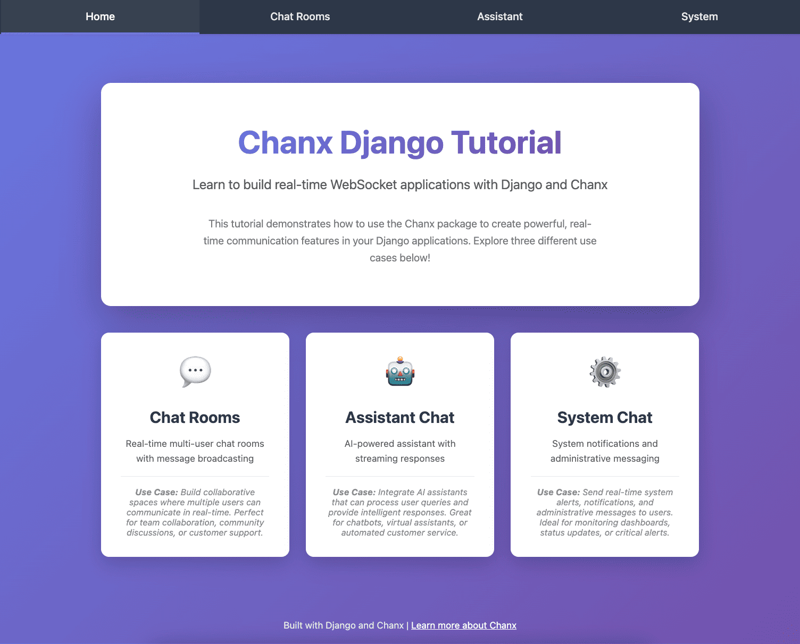

Part 1: Setup Chanx
===================

In this part, you'll set up the foundational Django project and install Chanx. By the end, you'll have:

- A running Django project with Channels configured
- Chanx installed and integrated
- WebSocket routing configured
- AsyncAPI documentation accessible

Starting Point: Checkpoint 0
-----------------------------

First, check out the ``cp0`` branch which has the initial Django project setup:

.. code-block:: bash

   git checkout cp0

What's Already Included
------------------------

The ``cp0`` branch includes a Django project with:

**Core Setup:**

- Django project with basic configuration
- HTML templates and views for:

  - Landing page
  - Chat page UI (no backend WebSocket code yet)
  - Assistants page UI (no backend WebSocket code yet)
  - System/notifications page UI (no backend WebSocket code yet)

- Shared chat component UI

**Django Channels Setup:**

- Django Channels installed and configured
- Daphne (ASGI server) for running WebSocket with ``runserver``
- Redis installed via Docker Compose
- Channel layer configured to use Redis

**Development Tools:**

- pyright - Static type checker
- mypy - Another static type checker
- ruff - Fast Python linter
- black - Code formatter
- pre-commit hooks configured

Installing Dependencies
-----------------------

**1. Start Redis with Docker Compose:**

Redis is required for Django Channels' channel layer, which enables broadcasting messages to multiple WebSocket connections.

.. code-block:: bash

   docker compose up -d

This starts Redis in the background. You should see output indicating Redis has started successfully.

**2. Create Virtual Environment and Install Dependencies:**

Using ``uv``, set up your Python environment:

.. code-block:: bash

   # Create virtual environment with pip/setuptools/wheel
   uv venv --seed

   # Install all dependencies (including dev tools)
   uv sync --all-extras

This installs Django, Channels, and all the development tools. The ``--all-extras`` flag ensures you get everything needed for development.

**3. Activate Virtual Environment:**

.. code-block:: bash

   # On macOS/Linux:
   source .venv/bin/activate

   # On Windows:
   .venv\Scripts\activate

You should see ``(.venv)`` prefix in your terminal prompt, indicating the virtual environment is active.

**4. Run Database Migrations:**

.. code-block:: bash

   python chanx_django/manage.py migrate

This sets up the initial database tables for Django.

**5. Verify the Setup:**

Let's make sure everything works before adding Chanx:

.. code-block:: bash

   # Start the development server
   python chanx_django/manage.py runserver

Visit http://localhost:8000 in your browser. You should see the landing page with links to Chat, Assistants, and System pages. The pages display UI, but WebSocket functionality doesn't work yet since we haven't implemented the backend.

Press ``Ctrl+C`` to stop the server.

Installing Chanx
----------------

Now let's add Chanx to the project:

.. code-block:: bash

   uv add "chanx[channels]"

This installs Chanx with Django Channels support. The ``[channels]`` extra includes all the Django-specific integrations.

Configuring Chanx
-----------------

We need to make several changes to integrate Chanx into the Django project.

**1. Add Chanx to Installed Apps**

Edit ``chanx_django/config/settings/base.py`` and add ``"chanx.channels"`` to ``INSTALLED_APPS``:

.. code-block:: python

   INSTALLED_APPS = [
       # Django apps
       "django.contrib.admin",
       "django.contrib.auth",
       "django.contrib.contenttypes",
       "django.contrib.sessions",
       "django.contrib.messages",
       "django.contrib.staticfiles",
       # Third-party apps
       "channels",
       "drf_spectacular",
       "chanx.channels",  # Add this line
       # Local apps
       "core",
       "chat",
       "assistants",
       "system",
   ]

This registers Chanx's Django app, which enables the AsyncAPI documentation URLs and other features.

**2. Create WebSocket Routing Configuration**

Create a new file ``chanx_django/config/routing.py`` to manage WebSocket routing:

.. code-block:: python

   """
   WebSocket routing configuration for the project.

   This module defines the WebSocket URL routing structure using Chanx's
   routing utilities. Routes are organized by app and mounted under /ws/.
   """
   from channels.routing import URLRouter
   from chanx.channels.routing import include, path

   # Main WebSocket router - include app-specific routers here
   ws_router = URLRouter(
       [
           # Uncomment these as you implement each app:
           # path("chat/", include("chat.routing")),
           # path("assistants/", include("assistants.routing")),
           # path("system/", include("system.routing")),
       ]
   )

   # Top-level router - mounts all WebSocket routes under /ws/
   router = URLRouter(
       [
           path("ws/", include(ws_router)),
       ]
   )

This creates a hierarchical routing structure:

- All WebSocket connections will be under ``/ws/``
- Each app (chat, assistants, system) will have its own sub-router
- We're using Chanx's ``include()`` and ``path()`` functions, which work like Django's URL routing

**3. Update ASGI Configuration**

Edit ``chanx_django/config/asgi.py`` to use Chanx routing:

.. code-block:: python

   """
   ASGI config for the project.

   This module exposes the ASGI application for both HTTP and WebSocket protocols.
   """
   import os

   from channels.routing import ProtocolTypeRouter
   from channels.sessions import CookieMiddleware
   from chanx.channels.routing import include
   from django.core.asgi import get_asgi_application

   os.environ.setdefault("DJANGO_SETTINGS_MODULE", "config.settings.base")

   # Get Django ASGI application for HTTP
   django_asgi_app = get_asgi_application()

   # Define protocol routing
   routing = {
       "http": django_asgi_app,
       "websocket": CookieMiddleware(include("config.routing")),
   }

   application: ProtocolTypeRouter = ProtocolTypeRouter(routing)

Key changes:

- Import ``CookieMiddleware`` from channels.sessions (for session support in WebSockets)
- Import ``include`` from chanx.channels.routing
- Wrap the WebSocket routing with ``CookieMiddleware`` to access Django sessions
- Use ``include("config.routing")`` to load our routing configuration

**4. Add AsyncAPI Documentation URL**

Edit ``chanx_django/config/urls.py`` to include Chanx's AsyncAPI documentation:

.. code-block:: python

   from django.contrib import admin
   from django.urls import include, path

   urlpatterns = [
       path("admin/", admin.site.urls),
       path("", include("core.urls")),
       path("chat/", include("chat.urls")),
       path("assistants/", include("assistants.urls")),
       path("system/", include("system.urls")),
       path("asyncapi/", include("chanx.channels.urls")),  # Add this line
   ]

This makes AsyncAPI documentation available at ``/asyncapi/``.

Testing the Setup
-----------------

Now let's verify everything is working:

**1. Run the Development Server:**

.. code-block:: bash

   python chanx_django/manage.py runserver

**2. View the Landing Page:**

Visit http://localhost:8000 - you should see the same landing page as before.

**3. View AsyncAPI Documentation:**

Visit http://localhost:8000/asyncapi/docs/ - you should see an AsyncAPI documentation page. It will be mostly empty since we haven't created any consumers yet, but it confirms Chanx is properly installed.

.. note::

   If you see a 404 error, make sure you:

   - Added ``"chanx.channels"`` to ``INSTALLED_APPS``
   - Added ``path("asyncapi/", include("chanx.channels.urls"))`` to ``urlpatterns``
   - Restarted the development server

Code Quality Tools
------------------

The project includes linting and type checking tools (ruff, black, mypy, pyright) already installed with ``uv sync --all-extras``.

**Install pre-commit hooks (recommended):**

.. code-block:: bash

   pre-commit install

This auto-runs linting, formatting, and checks before each commit.

**Manual checks:**

.. code-block:: bash

   # Lint and format
   scripts/lint.sh          # Check
   scripts/lint.sh --fix    # Auto-fix

   # Type check
   mypy chanx_django        # Using mypy
   pyright                  # Using pyright

   # Run all pre-commit checks manually
   pre-commit run --all-files

What's Next?
------------

Congratulations! You've successfully set up Chanx with Django. Your project now has:

- ✅ Chanx installed with Django Channels support
- ✅ WebSocket routing structure configured
- ✅ AsyncAPI documentation available
- ✅ All development tools ready to use

The code at this point matches the ``cp1`` branch. You can verify by checking out ``cp1``:

.. code-block:: bash

   git checkout cp1

In the next part, you'll build your first WebSocket consumer for the chat application, learning how to:

- Define message types with Pydantic
- Create consumers with the ``@channel`` decorator
- Handle WebSocket messages with ``@ws_handler``
- Broadcast messages to groups
- See your API automatically documented in AsyncAPI

.. toctree::
   :maxdepth: 1

   cp1-chat-websocket
