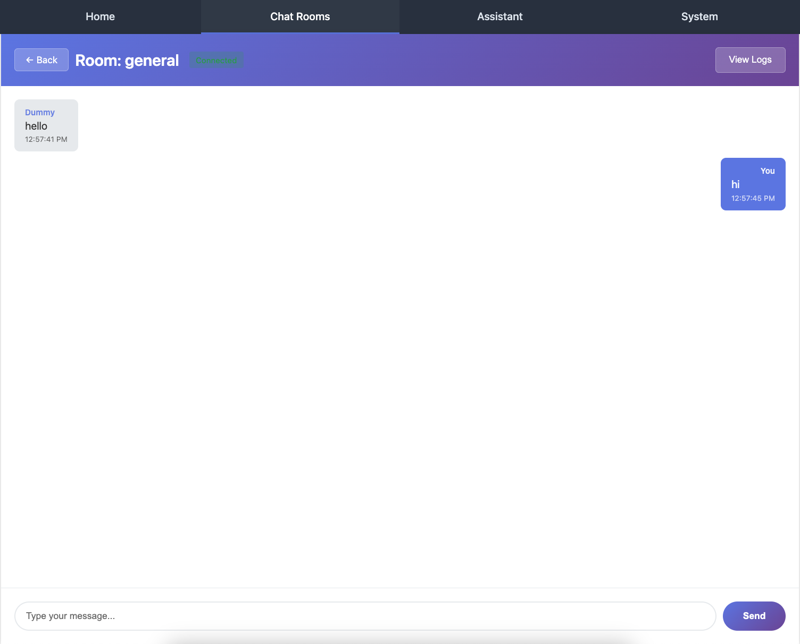

Part 2: Chat WebSocket
======================

In this part, you'll build your first real-time chat application using Chanx. You'll learn the core concepts of Chanx:

- Defining type-safe message models with Pydantic
- Creating WebSocket consumers
- Handling incoming messages with decorators
- Broadcasting messages to groups
- Dynamic routing with URL parameters

By the end, you'll have a working chat room where multiple users can send and receive messages in real-time.

Starting Point
--------------

Make sure you've completed Part 1 and have Chanx properly installed. If you want to start fresh from checkpoint 1:

.. code-block:: bash

   git checkout cp1
   git reset --hard

Understanding the Chat Flow
----------------------------

Before we start coding, let's understand how the chat system works:

1. **Client connects** to ``ws://localhost:8000/ws/chat/<group_name>/`` (e.g., ``/ws/chat/room1/``)
2. **Server adds client** to the group specified in the URL
3. **Client sends message** with their name and message text
4. **Server broadcasts** the message to all other clients in the same group
5. **All clients receive** the message and display it

The beauty of Chanx is that it handles the routing, validation, and type safety automatically!

Step 1: Define Message Types
-----------------------------

First, create a file to define your message structure. This uses Pydantic models for validation and type safety.

**Create** ``chat/messages.py``:

.. code-block:: python

   from typing import Literal

   from chanx.messages.base import BaseMessage
   from pydantic import BaseModel

   class ChatMessagePayload(BaseModel):
       message: str
       name: str

   class NewChatMessage(BaseMessage):
       action: Literal["new_chat_message"] = "new_chat_message"
       payload: ChatMessagePayload

**What's happening here?**

- ``ChatMessagePayload`` - A Pydantic model defining the data structure (message text and sender name)
- ``NewChatMessage`` - The actual message that will be sent over WebSocket

  - Extends ``BaseMessage`` (required for all Chanx messages)
  - ``action`` field uses ``Literal["new_chat_message"]`` - this is the discriminator that Chanx uses for automatic routing
  - ``payload`` contains the actual data

.. note::

   The ``action`` field with ``Literal`` type is crucial! Chanx uses this to automatically route incoming messages to the correct handler. The action value must be unique within each consumer.

Step 2: Create the WebSocket Consumer
--------------------------------------

Now let's create the consumer that handles WebSocket connections and messages.

**Create directory** ``chat/consumers/``:

.. code-block:: bash

   mkdir -p chat/consumers
   touch chat/consumers/__init__.py

**Create** ``chat/consumers/chat_consumer.py``:

.. code-block:: python

   from chanx.channels.websocket import AsyncJsonWebsocketConsumer
   from chanx.core.decorators import ws_handler
   from chanx.messages.incoming import PingMessage
   from chanx.messages.outgoing import PongMessage

   from chat.messages import NewChatMessage

   class ChatConsumer(AsyncJsonWebsocketConsumer):
       async def post_authentication(self) -> None:
           assert self.channel_layer
           self.group_name = self.scope["url_route"]["kwargs"]["group_name"]
           self.groups.append(self.group_name)
           await self.channel_layer.group_add(self.group_name, self.channel_name)

       @ws_handler
       async def handle_ping(self, _message: PingMessage) -> PongMessage:
           return PongMessage()

       @ws_handler(output_type=NewChatMessage)
       async def handle_new_chat_message(self, message: NewChatMessage) -> None:
           await self.broadcast_message(message, exclude_current=True)

**Let's break this down:**

**1. Class Definition:**

.. code-block:: python

   class ChatConsumer(AsyncJsonWebsocketConsumer):

Extends Chanx's ``AsyncJsonWebsocketConsumer``, which provides WebSocket handling with JSON serialization.

**2. Post Authentication Hook:**

.. code-block:: python

   async def post_authentication(self) -> None:
       assert self.channel_layer
       self.group_name = self.scope["url_route"]["kwargs"]["group_name"]
       self.groups.append(self.group_name)
       await self.channel_layer.group_add(self.group_name, self.channel_name)

This method runs after a client connects:

- Extracts ``group_name`` from the URL (e.g., from ``/ws/chat/room1/``, group_name is "room1")
- Adds the group to ``self.groups`` list (for automatic cleanup on disconnect)
- Joins the channel layer group (enables broadcasting to all connections in this group)

**3. Ping Handler:**

.. code-block:: python

   @ws_handler
   async def handle_ping(self, _message: PingMessage) -> PongMessage:
       return PongMessage()

The ``@ws_handler`` decorator registers this method as a message handler:

- Automatically routes incoming messages with ``action: "ping"`` to this handler
- Validates incoming message against ``PingMessage`` type
- Returns ``PongMessage`` which is automatically sent back to the client

.. note::

   ``PingMessage`` and ``PongMessage`` are built-in message types provided by Chanx for health checks.

**4. Chat Message Handler:**

.. code-block:: python

   @ws_handler(output_type=NewChatMessage)
   async def handle_new_chat_message(self, message: NewChatMessage) -> None:
       await self.broadcast_message(message, exclude_current=True)

This is the core chat functionality:

- ``@ws_handler(output_type=NewChatMessage)`` - Declares that this handler broadcasts ``NewChatMessage`` (used for AsyncAPI docs)
- Automatically validates incoming messages against ``NewChatMessage`` type
- ``broadcast_message()`` sends the message to all clients in the same group
- ``exclude_current=True`` means the sender won't receive their own message back

Step 3: Create WebSocket Routing
---------------------------------

Now we need to set up routing so WebSocket connections reach our consumer.

**Create** ``chat/routing.py``:

.. code-block:: python

   from channels.routing import URLRouter
   from chanx.channels.routing import path

   from chat.consumers.chat_consumer import ChatConsumer

   router = URLRouter(
       [
           path("<str:group_name>/", ChatConsumer.as_asgi()),
       ]
   )

**What this does:**

- Creates a ``URLRouter`` for the chat app
- ``path("<str:group_name>/", ...)`` - Dynamic route that captures the group name from the URL
- ``ChatConsumer.as_asgi()`` - Converts the consumer to an ASGI application

So if a client connects to ``/ws/chat/room1/``, the ``group_name`` will be "room1".

Step 4: Enable Chat Routing
----------------------------

Finally, we need to include the chat routing in the main WebSocket router.

**Edit** ``config/routing.py`` and uncomment the chat line:

.. code-block:: python

   from channels.routing import URLRouter
   from chanx.channels.routing import include, path

   ws_router = URLRouter(
       [
           path("chat/", include("chat.routing")),  # Uncomment this line
           # path("assistants/", include("assistants.routing")),
           # path("system/", include("system.routing")),
       ]
   )

   router = URLRouter(
       [
           path("ws/", include(ws_router)),
       ]
   )

Now the full WebSocket URL structure is:

- ``/ws/chat/<group_name>/`` → ``ChatConsumer``

Testing the Chat
----------------

Let's test the chat functionality!

**1. Start the Development Server:**

.. code-block:: bash

   python chanx_django/manage.py runserver

**2. Open Multiple Browser Windows:**

Visit http://localhost:8000/chat/ in 2-3 different browser windows or tabs.

**3. Join the Same Chat Room:**

In each browser window:

1. Enter a name (e.g., "Alice", "Bob", "Charlie")
2. Enter a room name (e.g., "room1")
3. Click "Join"

**4. Send Messages:**

Type messages in any window and press Enter or click Send. You should see:

- The message appears in **all other windows** (but not the sender's window, because of ``exclude_current=True``)
- Messages are delivered in real-time
- Each message shows the sender's name

**5. Test Different Rooms:**

Open another browser window and join a different room (e.g., "room2"). Messages in "room1" won't appear in "room2" - they're isolated by group.

**6. View AsyncAPI Documentation:**

Visit http://localhost:8000/asyncapi/docs/ to see your chat API automatically documented:

- The ``NewChatMessage`` input/output types
- The ``PingMessage``/``PongMessage`` handlers
- Message schemas with field descriptions

Understanding the Code Flow
----------------------------

Let's trace what happens when Alice sends a message:

1. **Client (Alice's browser)** sends JSON:

   .. code-block:: json

      {
        "action": "new_chat_message",
        "payload": {
          "message": "Hello everyone!",
          "name": "Alice"
        }
      }

2. **Chanx automatically**:

   - Receives the WebSocket message
   - Looks at the ``action`` field ("new_chat_message")
   - Routes it to ``handle_new_chat_message()`` based on the ``NewChatMessage`` type annotation
   - Validates the message structure using Pydantic

3. **Handler executes**:

   .. code-block:: python

      await self.broadcast_message(message, exclude_current=True)

   - Broadcasts the message to all connections in the group
   - Excludes Alice's connection (she already sees her message in the UI)

4. **Other clients** (Bob, Charlie) receive the message and display it

Key Concepts Review
-------------------

Let's review what you've learned:

**Message Types:**

- Messages extend ``BaseMessage``
- Use ``Literal`` type for the ``action`` field (discriminator)
- Payload can be any Pydantic model
- Automatic validation and type checking

**Consumer:**

- Extend ``AsyncJsonWebsocketConsumer``
- Use ``post_authentication()`` to run code after connection
- Join groups using ``channel_layer.group_add()``

**Handlers:**

- Use ``@ws_handler`` decorator
- Chanx automatically routes based on message type
- Return a message to send to the client
- Use ``broadcast_message()`` to send to groups

**Routing:**

- Use Chanx's ``path()`` and ``include()`` functions
- Support dynamic URL parameters
- Hierarchical routing structure

Common Patterns
---------------

**Pattern 1: Access URL Parameters**

.. code-block:: python

   group_name = self.scope["url_route"]["kwargs"]["group_name"]

**Pattern 2: Broadcast to Group**

.. code-block:: python

   await self.broadcast_message(message, exclude_current=True)

**Pattern 3: Send to Current Client Only**

.. code-block:: python

   await self.send_message(message)

**Pattern 4: Return Message from Handler**

.. code-block:: python

   @ws_handler
   async def handle_something(self, message: SomeMessage) -> ResponseMessage:
       return ResponseMessage(payload=...)  # Automatically sent to client

What's Next?
------------

Congratulations! You've built a real-time chat application with:

- ✅ Type-safe message handling
- ✅ Automatic message routing and validation
- ✅ Group broadcasting
- ✅ Dynamic URL routing
- ✅ Auto-generated AsyncAPI documentation

The code at this point matches the ``cp2`` branch:

.. code-block:: bash

   git checkout cp2

In the next part, you'll build an AI assistants chat system that demonstrates:

- Server-initiated messages
- More complex message structures
- Integration with external services (AI APIs)
- Advanced broadcasting patterns

.. toctree::
   :maxdepth: 1

   cp2-assistants-websocket
