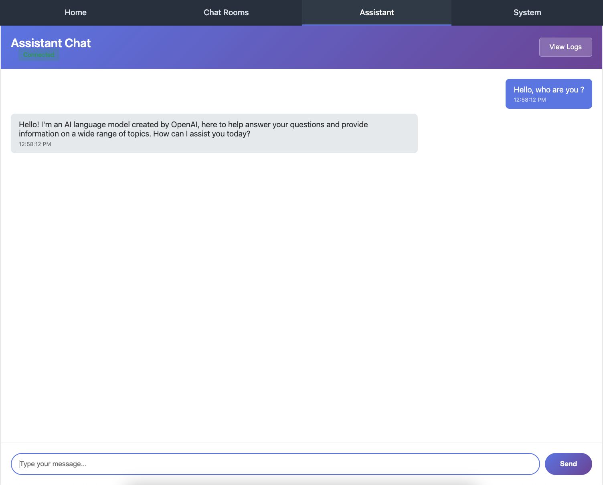
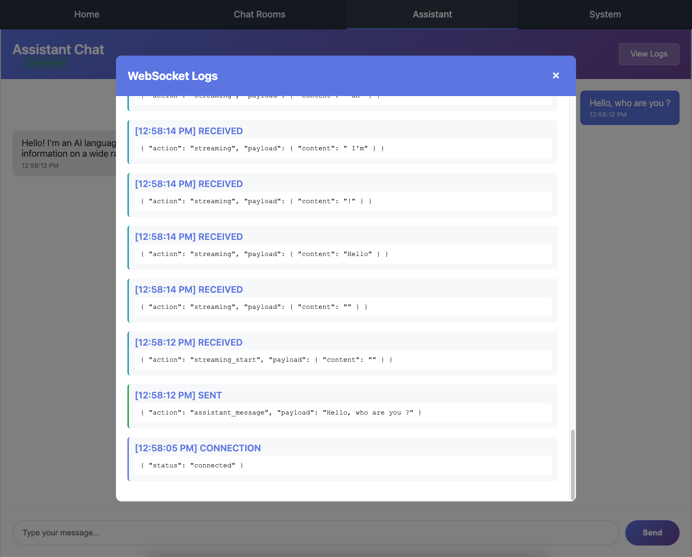

Part 3: Assistants WebSocket
============================

In this part, you'll build an AI-powered chat assistant with streaming responses. This section demonstrates more advanced Chanx features:

- Using the ``@channel`` decorator for consumer metadata
- Server-initiated messages (sending without receiving first)
- Streaming responses with multiple message types
- Stateful consumers with conversation history
- Integrating external services (OpenAI API)
- Union types for multiple output messages

By the end, you'll have a working AI assistant that responds to user messages with streaming text, just like ChatGPT.

Starting Point
--------------

Make sure you've completed Part 2. If you want to start fresh from checkpoint 2:

.. code-block:: bash

   git checkout cp2
   git reset --hard

Understanding Streaming Responses
----------------------------------

Unlike the chat app where messages flow client → server → other clients, the assistants app uses **streaming**:

1. **Client sends** a message: "What is Python?"
2. **Server sends** "streaming_start" signal
3. **Server sends** multiple "streaming" chunks: "Python", " is", " a", " programming", " language..."
4. **Server sends** "complete_streaming" signal

The client receives and displays tokens as they arrive, creating a smooth typing effect.

Step 1: Install Dependencies
-----------------------------

The assistants app uses LangChain to interact with OpenAI's API.

.. code-block:: bash

   uv add langchain langchain-openai

This installs:

- ``langchain`` - Framework for building LLM applications
- ``langchain-openai`` - OpenAI integration for LangChain

Step 2: Configure OpenAI API Key
---------------------------------

Before writing code, let's set up the OpenAI API key as a prerequisite.

**1. Add Django Settings:**

**Edit** ``chanx_django/config/settings/base.py`` and add at the end:

.. code-block:: python

   # =========================================================================
   # AI CONFIGURATION
   # =========================================================================

   OPENAI_API_KEY = env.str("OPENAI_API_KEY", "")
   OPENAI_ORG = env.str("OPENAI_ORG", "")

**2. Create .env File:**

Create a ``.env`` file in the project root (same directory as ``docker-compose.yml``):

.. code-block:: bash

   touch .env

**3. Add API Keys to .env:**

Open the ``.env`` file and add your OpenAI credentials:

.. code-block:: bash

   # OpenAI Configuration
   OPENAI_API_KEY=your-actual-api-key-here
   OPENAI_ORG=  # Optional - leave empty if you don't have an organization

**Replace** ``your-actual-api-key-here`` with your OpenAI API key.

**To get an OpenAI API key:**

1. Visit https://platform.openai.com/api-keys
2. Sign in or create an account
3. Click "Create new secret key"
4. Copy the key and paste it in your ``.env`` file

.. note::

   The ``OPENAI_ORG`` setting is **optional**. You can leave it empty unless your API key is associated with a specific OpenAI organization.

.. warning::

   **Never commit your `.env` file to Git!** The ``.gitignore`` file should already include ``.env`` to prevent accidentally committing sensitive data.

Step 3: Define Message Types
-----------------------------

We need four message types: one incoming and three outgoing.

**Create** ``chanx_django/assistants/messages.py``:

.. code-block:: python

   from typing import Literal

   from chanx.messages.base import BaseMessage
   from pydantic import BaseModel

   class StreamingPayload(BaseModel):
       """Payload for streaming messages."""

       content: str

   # Incoming messages (Client → WebSocket)
   class AssistantMessage(BaseMessage):
       """User message to the assistant."""

       action: Literal["assistant_message"] = "assistant_message"
       payload: str

   # Outgoing messages (WebSocket → Client)
   class StreamingStartMessage(BaseMessage):
       """Signal that streaming is starting."""

       action: Literal["streaming_start"] = "streaming_start"
       payload: StreamingPayload

   class StreamingMessage(BaseMessage):
       """Streaming message chunk from assistant."""

       action: Literal["streaming"] = "streaming"
       payload: StreamingPayload

   class CompleteStreamingMessage(BaseMessage):
       """Signal that streaming is complete."""

       action: Literal["complete_streaming"] = "complete_streaming"
       payload: StreamingPayload

**Key differences from chat messages:**

- **AssistantMessage**: Payload is just a string (simpler than chat which had name + message)
- **Three outgoing types**: Start, streaming chunks, and completion signal
- **Shared payload**: All outgoing messages use ``StreamingPayload``

Step 4: Create AI Service
--------------------------

Now let's create the service that communicates with OpenAI.

**Create directory** ``assistants/services/``:

.. code-block:: bash

   mkdir -p chanx_django/assistants/services
   touch chanx_django/assistants/services/__init__.py

**Create** ``chanx_django/assistants/services/ai_service.py``:

.. code-block:: python

   from collections.abc import Iterator
   from typing import TypedDict

   from django.conf import settings
   from langchain_core.messages import AIMessage, BaseMessage, HumanMessage
   from langchain_openai import ChatOpenAI
   from pydantic import SecretStr

   class ConversationMessage(TypedDict):
       """Type definition for conversation history messages."""

       role: str
       content: str

   class OpenAIService:
       """OpenAI backend using LangChain."""

       def __init__(self, model: str = "gpt-4o", temperature: float = 0.7):
           """Initialize OpenAI backend.

           Args:
               model: OpenAI model to use
               temperature: Temperature for response generation
           """

           self.llm = ChatOpenAI(
               model=model,
               temperature=temperature,
               api_key=SecretStr(getattr(settings, "OPENAI_API_KEY", "")),
               organization=getattr(settings, "OPENAI_ORG", None),
               streaming=True,
           )

       def format_messages(
           self, message: str, conversation_history: list[ConversationMessage]
       ) -> list[BaseMessage]:
           """Format conversation history into LangChain messages.

           Args:
               message: Current user message
               conversation_history: Previous conversation messages

           Returns:
               List of formatted LangChain messages
           """
           messages: list[BaseMessage] = []

           # Add conversation history
           for msg in conversation_history:
               if msg.get("role") == "user":
                   messages.append(HumanMessage(content=msg["content"]))
               else:
                   messages.append(AIMessage(content=msg["content"]))

           # Add current message
           messages.append(HumanMessage(content=message))

           return messages

       def generate_stream(
           self, message: str, conversation_history: list[ConversationMessage]
       ) -> Iterator[str]:
           """Generate streaming response from OpenAI.

           Args:
               message: User message
               conversation_history: Previous conversation messages

           Yields:
               Tokens from the AI response
           """
           messages = self.format_messages(message, conversation_history)

           # Stream the response
           for chunk in self.llm.stream(messages):
               yield chunk.text()

**What this service does:**

- **ConversationMessage**: TypedDict for type-safe conversation history
- **OpenAIService**: Wrapper around LangChain's ChatOpenAI

  - ``__init__``: Configures the model with API key from settings
  - ``format_messages``: Converts conversation history to LangChain format
  - ``generate_stream``: Yields tokens from the AI response

.. note::

   The ``streaming=True`` parameter in ``ChatOpenAI`` enables token-by-token streaming instead of waiting for the complete response.

Step 5: Create the WebSocket Consumer
--------------------------------------

Now create the consumer that uses the AI service and handles streaming.

**Create** ``chanx_django/assistants/conversation_consumer.py``:

.. code-block:: python

   from typing import Any

   from chanx.channels.websocket import AsyncJsonWebsocketConsumer
   from chanx.core.decorators import channel, ws_handler
   from chanx.messages.incoming import PingMessage
   from chanx.messages.outgoing import PongMessage

   from assistants.messages import (
       AssistantMessage,
       CompleteStreamingMessage,
       StreamingMessage,
       StreamingPayload,
       StreamingStartMessage,
   )
   from assistants.services.ai_service import ConversationMessage, OpenAIService

   @channel(
       name="assistants", description="AI Assistant WebSocket API", tags=["ai", "chat"]
   )
   class ConversationAssistantConsumer(AsyncJsonWebsocketConsumer):
       """WebSocket consumer for AI assistant chat."""

       def __init__(self, *args: Any, **kwargs: Any):
           super().__init__(*args, **kwargs)
           self.conversation_history: list[ConversationMessage] = []

       @ws_handler(
           summary="Handle ping requests",
           description="Simple ping-pong for connectivity testing",
       )
       async def handle_ping(self, _message: PingMessage) -> PongMessage:
           return PongMessage()

       @ws_handler(
           summary="Handle user message",
           description="Process user message and generate AI response",
           output_type=StreamingStartMessage | StreamingMessage | CompleteStreamingMessage,
       )
       async def handle_assistant_message(self, message: AssistantMessage) -> None:
           """Handle incoming user message and generate AI response with streaming."""

           ai_service = OpenAIService()

           # Add user message to history
           self.conversation_history.append({"role": "user", "content": message.payload})

           # Send streaming start signal
           await self.send_message(
               StreamingStartMessage(payload=StreamingPayload(content=""))
           )

           # Generate streaming response
           complete_response = ""
           for token in ai_service.generate_stream(
               message.payload, self.conversation_history[:-1]  # Exclude current message
           ):
               complete_response += token
               # Send streaming chunk
               await self.send_message(
                   StreamingMessage(payload=StreamingPayload(content=token))
               )

           # Add assistant response to history
           self.conversation_history.append(
               {"role": "assistant", "content": complete_response}
           )

           # Send completion signal
           await self.send_message(
               CompleteStreamingMessage(payload=StreamingPayload(content=""))
           )

**Let's break this down:**

**1. The @channel Decorator:**

.. code-block:: python

   @channel(
       name="assistants", description="AI Assistant WebSocket API", tags=["ai", "chat"]
   )

The ``@channel`` decorator adds metadata to the consumer:

- ``name``: Custom name for AsyncAPI documentation
- ``description``: Describes what this WebSocket endpoint does
- ``tags``: Categorizes the endpoint (useful for organizing docs)

This metadata appears in the auto-generated AsyncAPI documentation.

**2. Stateful Consumer:**

.. code-block:: python

   def __init__(self, *args: Any, **kwargs: Any):
       super().__init__(*args, **kwargs)
       self.conversation_history: list[ConversationMessage] = []

Unlike the stateless chat consumer, this stores conversation history per connection. Each WebSocket connection maintains its own chat context.

**3. Enhanced @ws_handler:**

.. code-block:: python

   @ws_handler(
       summary="Handle user message",
       description="Process user message and generate AI response",
       output_type=StreamingStartMessage | StreamingMessage | CompleteStreamingMessage,
   )

The decorator now includes:

- ``summary``: Brief description (appears in AsyncAPI docs)
- ``description``: Detailed explanation
- ``output_type``: **Union type** using ``|`` operator - tells Chanx this handler can send any of these three message types

**4. Streaming Handler:**

.. code-block:: python

   async def handle_assistant_message(self, message: AssistantMessage) -> None:
       ai_service = OpenAIService()

       # Add user message to history
       self.conversation_history.append({"role": "user", "content": message.payload})

       # Send streaming start signal
       await self.send_message(
           StreamingStartMessage(payload=StreamingPayload(content=""))
       )

       # Generate streaming response
       complete_response = ""
       for token in ai_service.generate_stream(
           message.payload, self.conversation_history[:-1]
       ):
           complete_response += token
           # Send streaming chunk
           await self.send_message(
               StreamingMessage(payload=StreamingPayload(content=token))
           )

       # Add assistant response to history
       self.conversation_history.append(
           {"role": "assistant", "content": complete_response}
       )

       # Send completion signal
       await self.send_message(
           CompleteStreamingMessage(payload=StreamingPayload(content=""))
       )

The flow:

1. Store user message in history
2. Signal streaming start
3. Loop through AI-generated tokens, sending each one immediately
4. Store complete AI response in history
5. Signal streaming complete

.. tip::

   We pass ``self.conversation_history[:-1]`` to exclude the current message because we already append it to the list and pass it as the ``message`` parameter.

Step 6: Create Routing
----------------------

**Create** ``chanx_django/assistants/routing.py``:

.. code-block:: python

   from channels.routing import URLRouter
   from chanx.channels.routing import path

   from assistants.conversation_consumer import ConversationAssistantConsumer

   router = URLRouter(
       [
           path("", ConversationAssistantConsumer.as_asgi()),
       ]
   )

Unlike the chat app, we don't need URL parameters. The URL is simply ``/ws/assistants/``.

Step 7: Enable Assistants Routing
----------------------------------

**Edit** ``chanx_django/config/routing.py`` and uncomment the assistants line:

.. code-block:: python

   from channels.routing import URLRouter
   from chanx.channels.routing import include, path

   ws_router = URLRouter(
       [
           path("chat/", include("chat.routing")),
           path("assistants/", include("assistants.routing")),  # Uncomment this
           # path("system/", include("system.routing")),
       ]
   )

   router = URLRouter(
       [
           path("ws/", include(ws_router)),
       ]
   )

Testing the Assistant
---------------------

**1. Start the Development Server:**

.. code-block:: bash

   python chanx_django/manage.py runserver

**2. Open the Assistants Page:**

Visit http://localhost:8000/assistants/

**3. Send a Message:**

Type a message like "What is Python?" and press Enter or click Send.

**4. Watch the Streaming Response:**

You should see:

- The AI response appears **word by word** or **token by token**
- Text flows smoothly like typing
- Each token is sent as a separate WebSocket message

*The complete response as displayed to the user*

*Browser console showing the multiple streaming messages received (streaming_start, streaming chunks, complete_streaming)*

**5. Continue the Conversation:**

Send follow-up messages like "Can you give me an example?". The assistant remembers the conversation context!

**6. View AsyncAPI Documentation:**

Visit http://localhost:8000/asyncapi/docs/ and notice:

- The ``@channel`` decorator's metadata is shown
- All four message types are documented
- The ``summary`` and ``description`` from ``@ws_handler`` appear
- The union output type shows all three possible response messages

Understanding Server-Initiated Messages
----------------------------------------

This is a key difference from the chat app:

**Chat App (Request-Response):**

.. code-block:: text

   Client sends NewChatMessage
   → Server broadcasts NewChatMessage to group

**Assistants App (Server-Initiated Streaming):**

.. code-block:: text

   Client sends AssistantMessage
   → Server sends StreamingStartMessage (no client request)
   → Server sends StreamingMessage (no client request)
   → Server sends StreamingMessage (no client request)
   → ... more chunks ...
   → Server sends CompleteStreamingMessage (no client request)

The server sends multiple messages in response to a single client message. This is perfect for:

- Streaming AI responses
- Progress updates for long operations
- Real-time notifications
- Multi-step workflows

Conversation State Management
------------------------------

The consumer maintains conversation history per connection:

.. code-block:: python

   def __init__(self, *args: Any, **kwargs: Any):
       super().__init__(*args, **kwargs)
       self.conversation_history: list[ConversationMessage] = []

**Important behaviors:**

- Each WebSocket connection has its own history
- History persists for the lifetime of the connection
- When the connection closes, history is lost
- Different browser tabs = different conversations

For production, you'd typically:

1. Store conversation history in a database
2. Load history when connection opens
3. Save new messages to the database
4. Associate conversations with user accounts

Advanced Concepts
-----------------

**Union Types for Output:**

.. code-block:: python

   output_type=StreamingStartMessage | StreamingMessage | CompleteStreamingMessage

This tells Chanx (and AsyncAPI docs) that this handler can send any of these three types. The ``|`` operator creates a union type.

**Type-Safe History:**

.. code-block:: python

   self.conversation_history: list[ConversationMessage] = []

Using ``TypedDict`` provides type safety for conversation messages without the overhead of Pydantic models.

**Iterator Pattern:**

.. code-block:: python

   def generate_stream(self, ...) -> Iterator[str]:
       for chunk in self.llm.stream(messages):
           yield chunk.text()

The service yields tokens one at a time, allowing the consumer to send them immediately rather than waiting for the complete response.

Common Patterns
---------------

**Pattern 1: Send Multiple Message Types**

.. code-block:: python

   @ws_handler(output_type=MessageA | MessageB | MessageC)
   async def handler(self, message: InputMessage) -> None:
       await self.send_message(MessageA(...))
       await self.send_message(MessageB(...))
       await self.send_message(MessageC(...))

**Pattern 2: Streaming Data**

.. code-block:: python

   for chunk in data_source:
       await self.send_message(ChunkMessage(payload=chunk))

**Pattern 3: Progress Updates**

.. code-block:: python

   await self.send_message(ProgressMessage(payload={"percent": 0}))
   # ... do work ...
   await self.send_message(ProgressMessage(payload={"percent": 50}))
   # ... do more work ...
   await self.send_message(ProgressMessage(payload={"percent": 100}))

**Pattern 4: Stateful Consumer**

.. code-block:: python

   def __init__(self, *args: Any, **kwargs: Any):
       super().__init__(*args, **kwargs)
       self.state = {}  # Per-connection state

What's Next?
------------

Excellent work! You've built an AI assistant with:

- ✅ Streaming responses with multiple message types
- ✅ Server-initiated messages
- ✅ Stateful consumers with conversation history
- ✅ External service integration (OpenAI)
- ✅ Enhanced AsyncAPI documentation with metadata
- ✅ Union types for flexible output

The code at this point matches the ``cp3`` branch:

.. code-block:: bash

   git checkout cp3

In the next part, you'll build a notification system that demonstrates:

- Channel layer events for server-to-server communication
- Broadcasting to specific users across different consumers
- Event handlers with ``@event_handler``
- System-wide notifications

.. toctree::
   :maxdepth: 1

   cp3-system-websocket
