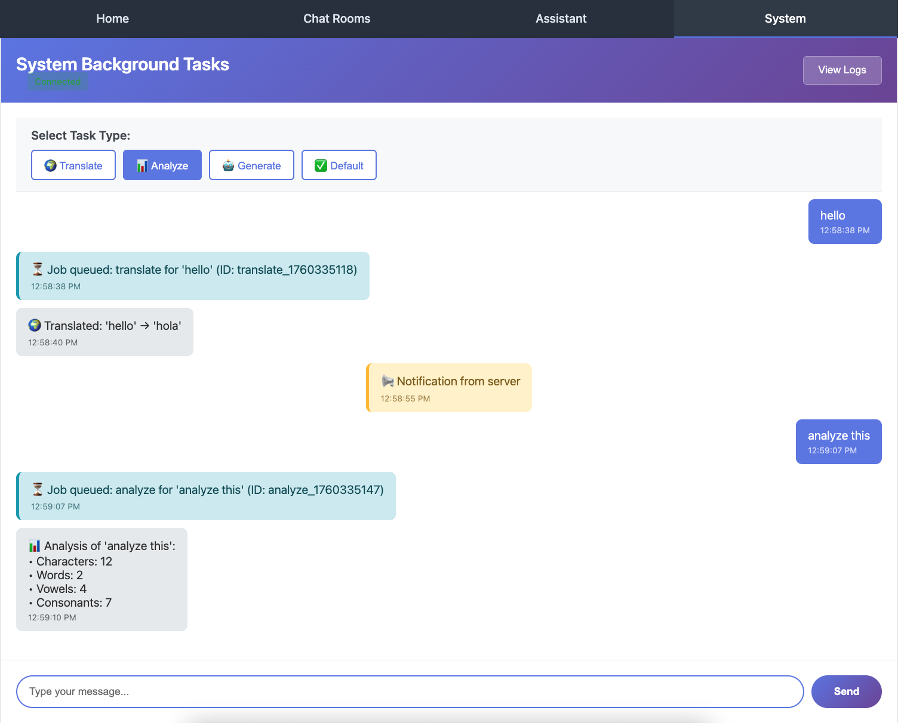

Part 4: System WebSocket
========================

In this part, you'll build a system for background task processing with real-time notifications. This demonstrates advanced Chanx concepts:

- Using ``@event_handler`` decorator for channel layer events
- Server-to-server communication via channel layer
- Integration with Celery for background tasks
- Broadcasting system-wide notifications
- WebSocket → Background Task → WebSocket flow
- Management commands sending WebSocket messages

By the end, you'll have a working system where clients can queue background tasks and receive results in real-time.

Starting Point
--------------

Make sure you've completed Part 3. If you want to start fresh from checkpoint 3:

.. code-block:: bash

   git checkout cp3
   git reset --hard

Understanding the Architecture
-------------------------------

The system app demonstrates a complete background processing flow:

**1. Client Requests Task:**

.. code-block:: text

   Client → WebSocket → Queue Celery Task → Send "Job Queued" → Client

**2. Background Processing:**

.. code-block:: text

   Celery Worker → Process Task → Send Result via Channel Layer → WebSocket → Client

**3. System Notifications:**

.. code-block:: text

   Management Command → Channel Layer → All WebSockets → All Clients

This architecture allows you to offload heavy work from WebSocket connections while keeping users updated in real-time.

Step 1: Install Celery
-----------------------

Celery is a distributed task queue for Python.

.. code-block:: bash

   uv add celery
   uv add --dev celery-types

This installs:

- ``celery`` - Background task processing
- ``celery-types`` - Type hints for better IDE support and type checking

Step 2: Configure Celery
-------------------------

**1. Create Celery App:**

**Create** ``config/celery.py``:

.. code-block:: python

   """
   Celery configuration for chanx_django project.
   """

   import os

   from celery import Celery

   # Set the default Django settings module for the 'celery' program.
   os.environ.setdefault("DJANGO_SETTINGS_MODULE", "config.settings.base")

   app = Celery("chanx_django")

   # Using a string here means the worker doesn't have to serialize
   # the configuration object to child processes.
   # - namespace='CELERY' means all celery-related configuration keys
   #   should have a `CELERY_` prefix.
   app.config_from_object("django.conf:settings", namespace="CELERY")

   # Load task modules from all registered Django apps.
   app.autodiscover_tasks()

**2. Initialize Celery in Config:**

**Edit** ``config/__init__.py``:

.. code-block:: python

   """
   This will make sure the app is always imported when
   Django starts so that shared_task will use this app.
   """

   from .celery import app as celery_app

   __all__ = ("celery_app",)

**3. Add Celery Settings:**

**Edit** ``config/settings/base.py`` and add at the end:

.. code-block:: python

   # =========================================================================
   # CELERY CONFIGURATION
   # =========================================================================

   CELERY_BROKER_URL = REDIS_URL
   CELERY_RESULT_BACKEND = REDIS_URL
   CELERY_TIMEZONE = TIME_ZONE

This configures Celery to use the same Redis instance as Django Channels for the message broker.

Step 3: Define Message Types
-----------------------------

We need four message types for the system app.

**Create** ``system/messages.py``:

.. code-block:: python

   from typing import Literal

   from chanx.messages.base import BaseMessage
   from pydantic import BaseModel

   class TaskPayload(BaseModel):
       """Payload for task request."""

       task_type: str
       content: str

   # Incoming messages (Client → WebSocket)
   class SystemMessage(BaseMessage):
       """User message to the system."""

       action: Literal["system_message"] = "system_message"
       payload: TaskPayload

   # Outgoing messages (WebSocket → Client)
   class JobQueued(BaseMessage):
       """Signal that job has been queued."""

       action: Literal["job_queued"] = "job_queued"
       payload: str

   class JobResult(BaseMessage):
       """Job result from background task."""

       action: Literal["job_result"] = "job_result"
       payload: str

   class SystemNotification(BaseMessage):
       """System notification message."""

       action: Literal["system_notification"] = "system_notification"
       payload: str

**Message Flow:**

- ``SystemMessage`` (incoming) - Client requests a background task
- ``JobQueued`` (outgoing) - Immediate acknowledgment that task was queued
- ``JobResult`` (outgoing) - Task result sent back when complete
- ``SystemNotification`` (outgoing) - System-wide broadcast messages

Step 4: Create Celery Tasks
----------------------------

Now let's create the background tasks that Celery will execute.

**Create** ``system/tasks.py``:

.. code-block:: python

   """
   Celery background tasks for system processing.
   """

   import time

   from asgiref.sync import async_to_sync
   from celery import shared_task

   @shared_task(ignore_result=True)
   def translate_text(job_id: str, content: str, channel_name: str) -> None:
       """
       Simulate text translation task.
       """
       # Simulate processing delay
       time.sleep(2)

       # Simple mock translation
       translations = {
           "hello": "hola",
           "world": "mundo",
           "good morning": "buenos días",
           "thank you": "gracias",
       }

       translated = translations.get(content.lower(), f"[TRANSLATED: {content}]")
       result = f"🌍 Translated: '{content}' → '{translated}'"

       # Send result back through channel layer
       _send_result_to_client(channel_name, result)

   @shared_task(ignore_result=True)
   def analyze_text(job_id: str, content: str, channel_name: str) -> None:
       """
       Simulate text analysis task.
       """
       # Simulate processing delay
       time.sleep(3)

       # Perform analysis
       word_count = len(content.split())
       char_count = len(content)
       vowel_count = sum(1 for char in content.lower() if char in "aeiou")
       consonant_count = sum(
           1 for char in content.lower() if char.isalpha() and char not in "aeiou"
       )

       result = (
           f"📊 Analysis of '{content}':\n"
           f"• Characters: {char_count}\n"
           f"• Words: {word_count}\n"
           f"• Vowels: {vowel_count}\n"
           f"• Consonants: {consonant_count}"
       )

       # Send result back through channel layer
       _send_result_to_client(channel_name, result)

   @shared_task(ignore_result=True)
   def generate_response(job_id: str, content: str, channel_name: str) -> None:
       """
       Simulate AI response generation.
       """
       # Simulate processing delay
       time.sleep(4)

       # Simple response generation based on keywords
       if "weather" in content.lower():
           response = "The weather is looking great today! Perfect for a walk outside."
       elif "food" in content.lower() or "eat" in content.lower():
           response = "I'd recommend trying that new restaurant downtown. Their pasta is excellent!"
       elif "help" in content.lower():
           response = "I'm here to help! Feel free to ask me anything you'd like to know."
       else:
           response = f"That's an interesting point about '{content}'. Let me think about that... Based on my analysis, I would suggest exploring this topic further through research and practical application."

       result = f"🤖 AI Response to '{content}':\n{response}"

       # Send result back through channel layer
       _send_result_to_client(channel_name, result)

   @shared_task(ignore_result=True)
   def process_default(job_id: str, content: str, channel_name: str) -> None:
       """
       Default processing task.
       """
       # Quick processing
       time.sleep(1)

       result = f"✅ Processed: {content.upper()}"

       # Send result back through channel layer
       _send_result_to_client(channel_name, result)

   def _send_result_to_client(channel_name: str, message: str) -> None:
       """
       Send the result back to the WebSocket client through the channel layer.
       """
       try:
           from system.consumers.system_consumer import SystemConsumer
           from system.messages import JobResult

           # Use async_to_sync to handle async function
           async_to_sync(SystemConsumer.send_event)(
               JobResult(payload=message), channel_name
           )

           # Alternatively, you can use the sync shortcut:
           # SystemConsumer.send_event_sync(JobResult(payload=message), channel_name)

       except Exception as e:
           print(f"Error sending result to client: {e}")

   # Task mapping
   TASK_FUNCTIONS = {
       "translate": translate_text,
       "analyze": analyze_text,
       "generate": generate_response,
       "default": process_default,
   }

**What's happening here:**

- Each task is decorated with ``@shared_task`` - makes it discoverable by Celery
- Tasks simulate processing with ``time.sleep()`` to mimic real work
- ``_send_result_to_client()`` uses ``async_to_sync()`` to call the async ``send_event()`` method
- ``SystemConsumer.send_event()`` sends a message to a **specific channel** (the original client)
- ``TASK_FUNCTIONS`` maps task types to their implementations

.. note::

   ``async_to_sync`` is required because Celery tasks run in a synchronous context, but Chanx's ``send_event()`` is async.

   **Shortcut:** You can also use ``SystemConsumer.send_event_sync()`` instead of ``async_to_sync(SystemConsumer.send_event)`` for cleaner code.

Step 5: Create the WebSocket Consumer
--------------------------------------

Now let's create the consumer that coordinates everything.

**Create directory** ``system/consumers/``:

.. code-block:: bash

   mkdir -p system/consumers
   touch system/consumers/__init__.py

**Create** ``system/consumers/system_consumer.py``:

.. code-block:: python

   import time

   from chanx.channels.websocket import AsyncJsonWebsocketConsumer
   from chanx.core.decorators import channel, event_handler, ws_handler
   from chanx.messages.incoming import PingMessage
   from chanx.messages.outgoing import PongMessage

   from system.messages import JobQueued, JobResult, SystemMessage, SystemNotification
   from system.tasks import TASK_FUNCTIONS

   @channel(
       name="system",
       description="System Background Tasks WebSocket API",
       tags=["system"],
   )
   class SystemConsumer(AsyncJsonWebsocketConsumer):
       """WebSocket consumer for system background tasks."""

       groups = ["system"]

       @ws_handler(
           summary="Handle ping requests",
           description="Simple ping-pong for connectivity testing",
       )
       async def handle_ping(self, _message: PingMessage) -> PongMessage:
           return PongMessage()

       @ws_handler(
           summary="Handle system task message",
           description="Queue a background task for processing",
           output_type=JobQueued,
       )
       async def handle_system_message(self, message: SystemMessage) -> None:
           """Handle incoming system message and queue background task."""

           task_type = message.payload.task_type
           content = message.payload.content

           # Get the task function or default
           task_func = TASK_FUNCTIONS.get(task_type, TASK_FUNCTIONS["default"])

           # Generate job ID
           job_id = f"{task_type}_{int(time.time())}"

           # Queue the Celery task
           task_func.delay(job_id, content, self.channel_name)

           # Send acknowledgment that job was queued
           await self.send_message(
               JobQueued(
                   payload=f"⏳ Job queued: {task_type} for '{content}' (ID: {job_id})"
               )
           )

       @event_handler
       async def handle_job_result(self, event: JobResult) -> JobResult:
           """
           Handle job results sent back from Celery workers.
           """
           return event

       @event_handler
       async def handle_system_notification(
           self, event: SystemNotification
       ) -> SystemNotification:
           """
           Handle system notifications broadcast from management commands.
           """
           return event

**Let's break down the key concepts:**

**1. Auto-Join Groups:**

.. code-block:: python

   groups = ["system"]

Setting ``groups`` as a class attribute automatically adds connections to the "system" group when they connect. No need for ``post_authentication()``.

**2. WebSocket Handler:**

.. code-block:: python

   @ws_handler(...)
   async def handle_system_message(self, message: SystemMessage) -> None:
       task_func = TASK_FUNCTIONS.get(task_type, TASK_FUNCTIONS["default"])
       task_func.delay(job_id, content, self.channel_name)
       await self.send_message(JobQueued(...))

This handler:

- Receives the client request
- Queues a Celery task with ``task_func.delay()``
- Passes ``self.channel_name`` so the task knows which client to respond to
- Immediately sends back a "Job Queued" acknowledgment

**3. Event Handlers:**

.. code-block:: python

   @event_handler
   async def handle_job_result(self, event: JobResult) -> JobResult:
       return event

The ``@event_handler`` decorator marks this method as a channel layer event handler:

- Automatically invoked when a ``JobResult`` message is sent via ``send_event()``
- Returns the event, which sends it to the client
- Routing is based on the message type annotation (``JobResult``), not the method name
- Method name ``handle_{action}`` is just a convention for readability

Similarly for ``handle_system_notification`` - handles broadcast notifications.

.. tip::

   **Optional: Generic Type Parameter for Better Type Hints**

   For enhanced type checking with mypy/pyright, you can specify event types your consumer receives:

   .. code-block:: python

      # Define which event types this consumer can receive
      class SystemConsumer(AsyncJsonWebsocketConsumer[JobResult | SystemNotification]):
          pass

      # Type checkers will catch errors at development time:
      SystemConsumer.broadcast_event_sync(JobResult(payload="result"))  # ✅ OK
      SystemConsumer.broadcast_event_sync(SystemNotification(payload="note"))  # ✅ OK
      SystemConsumer.broadcast_event_sync(PingMessage())  # ❌ Type error!

   **Pyright error:**

   .. code-block:: text

      error: Argument of type "PingMessage" cannot be assigned to parameter "event"
        of type "JobResult | SystemNotification" in function "broadcast_event_sync"
        Type "PingMessage" is not assignable to type "JobResult | SystemNotification"

   **Mypy error:**

   .. code-block:: text

      error: Argument 1 to "broadcast_event_sync" has incompatible type "PingMessage";
        expected "JobResult | SystemNotification"  [arg-type]

   This catches bugs during development before runtime, providing better IDE autocomplete and static analysis. The generic type doesn't affect runtime behavior.

.. important::

   **Key Difference:**

   - ``@ws_handler`` - Handles messages from **WebSocket clients**
   - ``@event_handler`` - Handles messages from **channel layer** (server-to-server)

Step 6: Create Routing
----------------------

**Create** ``system/routing.py``:

.. code-block:: python

   from channels.routing import URLRouter
   from chanx.channels.routing import path

   from system.consumers.system_consumer import SystemConsumer

   router = URLRouter(
       [
           path("", SystemConsumer.as_asgi()),
       ]
   )

Step 7: Enable System Routing
------------------------------

**Edit** ``config/routing.py`` and uncomment the system line:

.. code-block:: python

   from channels.routing import URLRouter
   from chanx.channels.routing import include, path

   ws_router = URLRouter(
       [
           path("chat/", include("chat.routing")),
           path("assistants/", include("assistants.routing")),
           path("system/", include("system.routing")),  # Uncomment this
       ]
   )

   router = URLRouter(
       [
           path("ws/", include(ws_router)),
       ]
   )

Step 8: Create Development Script
----------------------------------

To make development easier, let's create a script that runs both Django and Celery together.

**Create** ``chanx_django/start_dev.py``:

.. code-block:: python

   #!/usr/bin/env python3
   """
   Development startup script that runs both Django server and Celery worker.

   Usage:
       python chanx_django/start_dev.py

   This will start:
   1. Celery worker in the background
   2. Django development server with auto-reload

   Both processes will be managed together and stopped with Ctrl+C.
   """

   import signal
   import subprocess
   import sys
   import time
   from pathlib import Path
   from types import FrameType

   def main() -> None:
       """Start both Celery worker and Django server."""
       print("🚀 Starting development environment...")

       # Store process references
       celery_process = None
       django_process = None

       def cleanup(signum: int | None = None, frame: FrameType | None = None) -> None:
           """Clean up processes on exit."""
           print("\n🛑 Shutting down...")

           if celery_process:
               print("🔄 Stopping Celery worker...")
               celery_process.terminate()
               try:
                   celery_process.wait(timeout=5)
               except subprocess.TimeoutExpired:
                   celery_process.kill()

           if django_process:
               print("🌐 Stopping Django server...")
               django_process.terminate()
               try:
                   django_process.wait(timeout=5)
               except subprocess.TimeoutExpired:
                   django_process.kill()

           print("✅ Shutdown complete")
           sys.exit(0)

       # Set up signal handlers
       signal.signal(signal.SIGINT, cleanup)
       signal.signal(signal.SIGTERM, cleanup)

       try:
           # Get the directory where this script is located
           script_dir = Path(__file__).parent

           # Start Celery worker
           print("🔄 Starting Celery worker...")
           celery_process = subprocess.Popen(
               [
                   sys.executable,
                   "-m",
                   "celery",
                   "-A",
                   "config",
                   "worker",
                   "--loglevel=info",
               ],
               cwd=script_dir,
           )

           # Give Celery a moment to start
           time.sleep(2)

           # Start Django development server
           print("🌐 Starting Django development server...")
           django_process = subprocess.Popen(
               [sys.executable, "manage.py", "runserver", "8000"],
               cwd=script_dir,
           )

           print("\n✅ Development environment ready!")
           print("📱 Django app: http://localhost:8000")
           print("🔄 Celery worker: running in background")
           print("🛑 Press Ctrl+C to stop both services\n")

           # Keep the script running and wait for processes
           while True:
               # Check if any process has died
               if celery_process and celery_process.poll() is not None:
                   print("❌ Celery worker stopped unexpectedly")
                   cleanup()
               if django_process and django_process.poll() is not None:
                   print("❌ Django server stopped unexpectedly")
                   cleanup()

               time.sleep(1)

       except KeyboardInterrupt:
           pass
       except Exception as e:
           print(f"❌ Error: {e}")
       finally:
           cleanup()

   if __name__ == "__main__":
       main()

This script starts both services and manages them together, making development much easier.

Step 9: Create Management Command (Optional)
---------------------------------------------

Let's create a Django management command that can send system-wide notifications to all connected clients.

**Create directories:**

.. code-block:: bash

   mkdir -p system/management/commands
   touch system/management/__init__.py
   touch system/management/commands/__init__.py

**Create** ``system/management/commands/send_notification.py``:

.. code-block:: python

   """
   Management command to send notifications to all connected system WebSocket clients.

   Usage:
       python manage.py send_notification "Your message here"
       python manage.py send_notification "Server maintenance in 5 minutes" --repeat 3
   """

   import time
   from argparse import ArgumentParser
   from typing import Any

   from django.core.management.base import BaseCommand

   from system.consumers.system_consumer import SystemConsumer
   from system.messages import SystemNotification

   class Command(BaseCommand):
       help = "Send a notification to all connected system WebSocket clients"

       def add_arguments(self, parser: ArgumentParser) -> None:
           parser.add_argument(
               "message",
               type=str,
               help="The notification message to send",
           )
           parser.add_argument(
               "--repeat",
               type=int,
               default=1,
               help="Number of times to send the notification",
           )
           parser.add_argument(
               "--interval",
               type=int,
               default=1,
               help="Interval in seconds between repeated notifications",
           )

       def handle(self, *args: Any, **options: Any) -> None:
           message = options["message"]
           repeat = options["repeat"]
           interval = options["interval"]

           self.stdout.write(self.style.SUCCESS(f"Sending notification: {message}"))

           for i in range(repeat):
               if repeat > 1:
                   self.stdout.write(f"  Sending notification {i + 1}/{repeat}...")

               # Send notification to all connected clients in the system group
               SystemConsumer.broadcast_event_sync(SystemNotification(payload=message))

               self.stdout.write(self.style.SUCCESS("  ✅ Notification sent!"))

               # Wait before next iteration (except on last one)
               if i < repeat - 1:
                   time.sleep(interval)

           self.stdout.write(
               self.style.SUCCESS("\n✅ All notifications sent successfully!")
           )

**Key method:**

.. code-block:: python

   SystemConsumer.broadcast_event_sync(SystemNotification(payload=message))

``broadcast_event_sync()`` is a synchronous method that broadcasts an event to all clients in the consumer's groups. Perfect for management commands!

Testing the System
------------------

Now let's test the complete flow: WebSocket → Celery → WebSocket.

**1. Start the Development Environment:**

**Option A: Using the Development Script (Recommended for simplicity)**

.. code-block:: bash

   python chanx_django/start_dev.py

This starts both Django server and Celery worker together in a managed process. You should see output from both services.

**Option B: Separate Terminals (Recommended for better visibility)**

Open two separate terminal windows/tabs:

**Terminal 1 - Start Celery Worker:**

.. code-block:: bash

   cd chanx_django
   celery -A config worker --loglevel=info

**Terminal 2 - Start Django Server:**

.. code-block:: bash

   cd chanx_django
   python manage.py runserver

This approach gives you better visibility into each service's logs and allows you to restart them independently.

**2. Open the System Page:**

Visit http://localhost:8000/system/

**3. Queue a Background Task:**

1. Select a task type (Translate, Analyze, or Generate)
2. Enter some content (e.g., "hello" for translate, or any text for analyze)
3. Click "Submit Task"

**You should see:**

1. **Immediate**: "Job queued" message
2. **After processing**: Result message appears (2-4 seconds depending on task)

**4. Test Different Task Types:**

- **Translate**: Try "hello", "world", "good morning"
- **Analyze**: Try any sentence to see word/character analysis
- **Generate**: Try "weather", "food", or any text for AI-like responses

**5. Test System Notifications:**

Open a **new terminal** and run:

.. code-block:: bash

   python chanx_django/manage.py send_notification "Notification from server"

All connected clients should instantly receive the notification!

*Example showing: translate task result, analyze task result, and a system notification broadcast*

Try with repeat:

.. code-block:: bash

   python chanx_django/manage.py send_notification "Server restart in" --repeat 3 --interval 2

**6. View AsyncAPI Documentation:**

Visit http://localhost:8000/asyncapi/docs/ - you'll see all message types documented, including event handlers!

Key Concepts
------------

**Channel Layer Methods:**

.. code-block:: python

   # Send to specific channel
   await Consumer.send_event(message, channel_name)        # Async
   Consumer.send_event_sync(message, channel_name)         # Sync

   # Broadcast to all in group
   await Consumer.broadcast_event(message)                 # Async
   Consumer.broadcast_event_sync(message)                  # Sync

**Event Handlers:**

- Use ``@event_handler`` - handles messages from channel layer (not WebSocket)
- Routing via message type annotation (like ``@ws_handler``)
- Return the event to forward it to the client

**Celery + WebSocket Flow:**

1. Client sends message → Queue Celery task → Send "Job Queued" acknowledgment
2. Celery worker completes → ``send_event_sync()`` to specific channel → Client receives result
3. Management command → ``broadcast_event_sync()`` → All connected clients receive notification

Quick Reference
---------------

**WebSocket → Celery → WebSocket:**

.. code-block:: python

   # WebSocket handler: Queue task
   task_func.delay(data, self.channel_name)

   # Celery task: Send result back
   Consumer.send_event_sync(Result(result), channel_name)

   # Event handler: Forward to client
   @event_handler
   async def handle_result(self, event: Result) -> Result:
       return event

**System-Wide Broadcast:**

.. code-block:: python

   Consumer.broadcast_event_sync(Notification(payload="msg"))  # Sync
   await Consumer.broadcast_event(Notification(payload="msg"))  # Async

**Auto-Join Groups:**

.. code-block:: python

   class MyConsumer(AsyncJsonWebsocketConsumer):
       groups = ["notifications", "updates"]

What's Next?
------------

Congratulations! You've built a complete background task processing system with:

- ✅ Celery integration for background tasks
- ✅ Real-time task result notifications
- ✅ Event handlers for channel layer communication
- ✅ System-wide broadcasting
- ✅ Management commands sending WebSocket messages
- ✅ Development script for running multiple services

The code at this point matches the ``cp4`` branch:

.. code-block:: bash

   git checkout cp4

In the next part, you'll add comprehensive integration tests for all WebSocket endpoints, learning:

- Testing WebSocket consumers
- Testing event handlers
- Testing Celery task integration
- Using Chanx testing utilities

.. toctree::
   :maxdepth: 1

   cp4-integration-tests
