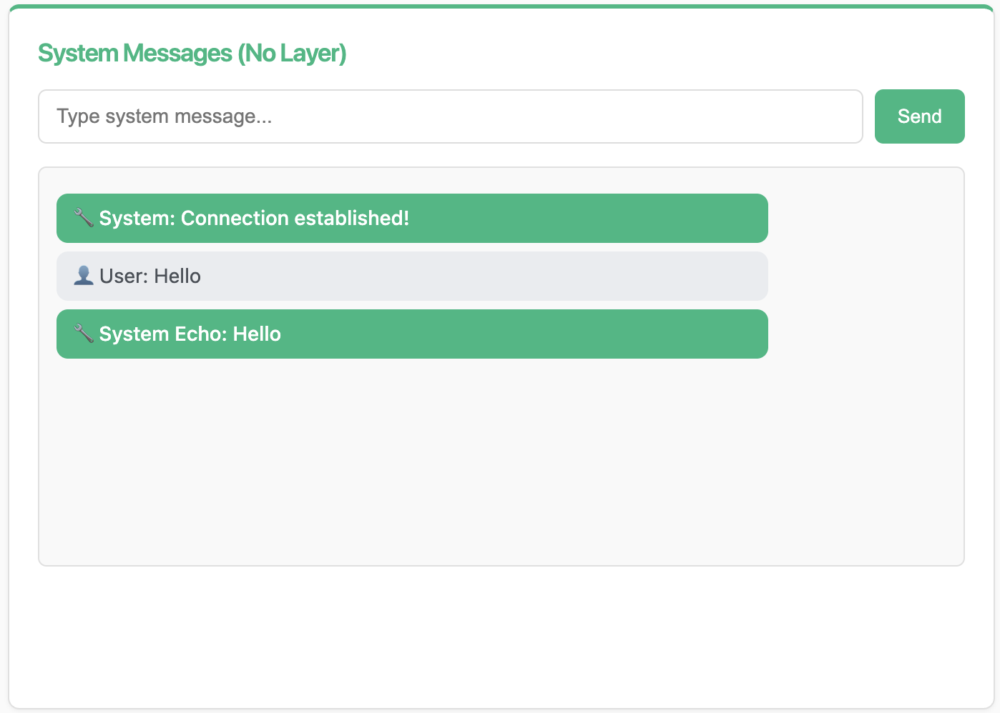

Part 1: Simple System Echo WebSocket
=====================================

In this part, you'll build your first WebSocket consumer using Chanx. This simple echo system demonstrates:

- Defining type-safe message models with Pydantic
- Creating WebSocket consumers with decorators
- Handling incoming messages with ``@ws_handler``
- Sending server-initiated messages
- Direct WebSocket communication (no channel layers)

Understanding the Echo Flow
----------------------------

The echo system works as follows:

1. **Client connects** to ``ws://localhost:8000/ws/system``
2. **Server sends welcome message** immediately
3. **Client sends message** → **Server echoes back** with prefix
4. **No broadcasting** - messages only return to the sender

This is direct WebSocket communication, perfect for understanding the basics.

Step 1: Define Message Types
-----------------------------

Create the message structure using Pydantic models for validation and type safety.

**Create** ``src/apps/system_chat/__init__.py``:

.. code-block:: python

   # System Chat App - Direct WebSocket communication without channel layers

**Create** ``src/apps/system_chat/messages.py``:

.. code-block:: python

   """
   Message types for the system chat consumer.
   """

   from typing import Literal

   from chanx.messages.base import BaseMessage
   from pydantic import BaseModel

   class MessagePayload(BaseModel):
       message: str

   class UserMessage(BaseMessage):
       """System message for direct communication."""

       action: Literal["user_message"] = "user_message"
       payload: MessagePayload

   class SystemEchoMessage(BaseMessage):
       """System echo response message."""

       action: Literal["system_echo"] = "system_echo"
       payload: MessagePayload

**Key points:**

- ``MessagePayload`` - Simple Pydantic model with a message field
- ``UserMessage`` - Client sends this with ``action: "user_message"``
- ``SystemEchoMessage`` - Server responds with ``action: "system_echo"``
- The ``action`` field with ``Literal`` enables automatic routing

.. note::

   The ``action`` field is crucial! Chanx uses it to automatically route incoming messages to the correct handler.

Step 2: Create the WebSocket Consumer
--------------------------------------

**Create** ``src/apps/system_chat/consumer.py``:

.. code-block:: python

   """
   System Chat Consumer - Direct WebSocket without channel layers.
   """

   from chanx.core.decorators import channel, ws_handler
   from chanx.messages.incoming import PingMessage
   from chanx.messages.outgoing import PongMessage

   from src.base_consumer import BaseConsumer

   from .messages import MessagePayload, SystemEchoMessage, UserMessage

   @channel(
       name="system",
       description="System Messages Consumer - Direct WebSocket without channel layers",
       tags=["system", "direct"],
   )
   class SystemMessageConsumer(BaseConsumer):
       """
       Consumer for system messages without using channel layers.
       Direct connection without group messaging.
       """

       @ws_handler(
           summary="Handle ping requests",
           description="Simple ping-pong for connectivity testing",
       )
       async def handle_ping(self, _message: PingMessage) -> PongMessage:
           return PongMessage()

       @ws_handler(
           summary="Handle message user send to system",
           description="Echo system messages back directly without using channel layers",
       )
       async def handle_system(self, message: UserMessage) -> SystemEchoMessage:
           """Handle system messages and echo them back directly."""
           return SystemEchoMessage(
               payload=MessagePayload(message=f"🔧 System Echo: {message.payload.message}")
           )

       async def post_authentication(self) -> None:
           """Send connection established message directly to client."""
           await self.send_message(
               SystemEchoMessage(
                   payload=MessagePayload(message="🔧 System: Connection established!")
               )
           )

**Key components:**

**@channel decorator** - Adds metadata for AsyncAPI documentation (name, description, tags)

**@ws_handler decorator** - Registers message handlers with automatic routing:

- ``handle_ping()`` - Responds to ping messages for health checks
- ``handle_system()`` - Echoes user messages back with a prefix
- Return value is automatically sent to the client

**post_authentication()** - Runs after connection, sends welcome message (server-initiated)

Step 3: Register the WebSocket Route
-------------------------------------

**Edit** ``src/main.py`` and uncomment the system chat code:

.. code-block:: python

   # Uncomment these lines:
   from src.apps.system_chat.consumer import (
       SystemMessageConsumer,  # Direct WebSocket (no layers)
   )

   # ... later in the file:
   ws_router.add_websocket_route(
       "/system", SystemMessageConsumer.as_asgi()
   )  # Direct WebSocket (no layers)

This registers the consumer at ``ws://localhost:8000/ws/system``

Step 4: Test the Echo System
-----------------------------

**1. Start the server:**

.. code-block:: bash

   uvicorn src.main:app --reload

**2. Open the application:**

Visit http://localhost:8000 and navigate to the System Chat page.

**3. Test:**

- The page auto-connects on load - you should see: **"🔧 System: Connection established!"**
- Type a message and send - you should see: **"🔧 System Echo: [your message]"**

The screenshot shows the System Messages interface with the connection message and an echoed "Hello" message.

Understanding the Message Flow
-------------------------------

When you send a message:

1. Client sends:

   .. code-block:: json

      {"action": "user_message", "payload": {"message": "Hello"}}

2. Chanx routes to ``handle_system()`` based on the ``action`` field

3. Handler returns ``SystemEchoMessage``

4. Server sends:

   .. code-block:: json

      {"action": "system_echo", "payload": {"message": "🔧 System Echo: Hello"}}

How Message Handlers Send Messages
------------------------------------

Understanding how messages are sent back to clients is important.

**Pattern 1: Return value sends to sender only**

.. code-block:: python

   @ws_handler
   async def handle_user_message(self, message: UserMessage) -> SystemEchoMessage:
       # What you return goes back to the sender only
       return SystemEchoMessage(payload=...)

The returned message is automatically sent to the client who sent the original message.

**Pattern 2: Broadcasting to multiple users**

.. code-block:: python

   @ws_handler(output_type=RoomNotificationMessage)
   async def handle_chat(self, message: ChatMessage) -> None:
       # Explicitly broadcast to send to multiple users
       await self.broadcast_message(
           RoomNotificationMessage(payload=...),
           groups=["room_general"]  # Can be omitted if groups defined as class attribute
       )

When broadcasting:

- Return type is ``None`` (not sending directly to sender)
- Use ``output_type`` parameter in ``@ws_handler`` for API documentation
- Call ``broadcast_message()`` explicitly
- ``groups`` parameter can be omitted if already defined as class attribute

.. note::

   You'll see more advanced messaging patterns, including server-to-server communication with event handlers, in Part 3.

AsyncAPI Documentation Mapping
~~~~~~~~~~~~~~~~~~~~~~~~~~~~~~~~

The ``@ws_handler`` decorator generates AsyncAPI **RECEIVE** actions (documenting what messages clients can send). When handlers have a return type or ``output_type`` parameter, the RECEIVE action includes a **reply field** describing the response message.

.. seealso::

   For detailed information about AsyncAPI mapping, see :doc:`../user-guide/consumers-decorators` → AsyncAPI Documentation Mapping section.

Key Concepts Review
-------------------

**Message Types:**

- Extend ``BaseMessage``
- Use ``Literal`` for the ``action`` field
- Automatic validation with Pydantic

**Consumer:**

- Extend ``BaseConsumer``
- Use ``@channel`` for metadata
- Use ``post_authentication()`` for connection setup

**Handlers:**

- Use ``@ws_handler`` to register handlers
- Automatic routing based on message type
- Return message to send to client

**FastAPI Integration:**

- Use ``app.add_websocket_route(path, Consumer.as_asgi())``

What's Next?
------------

You've built your first WebSocket consumer! You now understand:

- ✅ Type-safe message handling
- ✅ Automatic message routing
- ✅ Direct WebSocket communication
- ✅ Server-initiated messages

In the next part, you'll build a room-based chat system with:

- Dynamic URL routing with path parameters
- Channel layers for broadcasting
- Group-based message distribution

.. toctree::
   :maxdepth: 1

   cp2-room-chat
