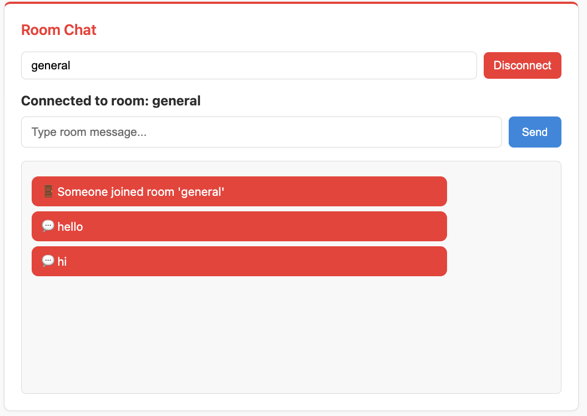
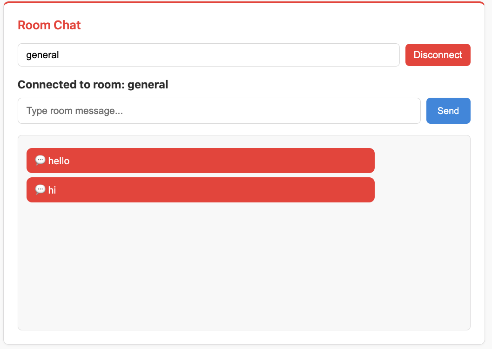

Part 2: Room Chat with Channel Layers
======================================

In this part, you'll build a room-based chat system using channel layers. This demonstrates:

- Setting up channel layers with Redis
- Dynamic URL routing with path parameters
- Group-based broadcasting
- Room isolation
- Join/leave notifications

Understanding Room Chat
-----------------------

The room chat system works as follows:

1. **Client connects** to ``ws://localhost:8000/ws/room/{room_name}``
2. **Server adds client** to the room's channel layer group
3. **Server broadcasts join notification** to other room members
4. **Client sends message** → **Server broadcasts** to all in the same room
5. **Client disconnects** → **Server broadcasts leave notification**

Rooms are isolated - messages in one room don't appear in other rooms.

Step 1: Setup Channel Layers
-----------------------------

Channel layers enable broadcasting messages between WebSocket connections. We'll use Redis for production-ready messaging.

**Create** ``src/layers.py``:

.. code-block:: python

   """
   Channel layer definitions and registration.
   This file centralizes all channel layer configuration for the application.
   """

   import os

   from fast_channels.layers import (
       InMemoryChannelLayer,
       has_layers,
       register_channel_layer,
   )
   from fast_channels.layers.redis import (
       RedisChannelLayer,
       RedisPubSubChannelLayer,
   )

   redis_url = os.getenv("REDIS_URL", "redis://localhost:6379")

   def setup_layers(force: bool = False) -> None:
       """
       Set up and register all channel layers for the application.
       This should be called once during application startup.
       """
       # Get Redis URL from environment or use default
       if has_layers() and not force:
           return

       # Create different types of layers
       layers_config = {
           # In-memory layer for development/testing
           "memory": InMemoryChannelLayer(),
           # Redis Pub/Sub layer for real-time messaging
           "chat": RedisPubSubChannelLayer(hosts=[redis_url], prefix="chat"),
           # Redis Queue layer for reliable messaging
           "queue": RedisChannelLayer(
               hosts=[redis_url],
               prefix="queue",
               expiry=900,  # 15 minutes
               capacity=1000,
           ),
           # Notifications layer with different prefix
           "notifications": RedisPubSubChannelLayer(hosts=[redis_url], prefix="notify"),
           # Analytics layer for metrics/events
           "analytics": RedisChannelLayer(
               hosts=[redis_url],
               prefix="analytics",
               expiry=3600,  # 1 hour
               capacity=5000,
           ),
       }

       # Register all layers
       for alias, layer in layers_config.items():
           register_channel_layer(alias, layer)

**Key points:**

- **InMemoryChannelLayer** - For development/testing (no Redis needed)
- **RedisPubSubChannelLayer** - Real-time messaging with pub/sub pattern
- **RedisChannelLayer** - Reliable queue-based messaging with expiry
- Each layer has an alias (``"chat"``, ``"queue"``, etc.) and different configuration
- The ``setup_layers()`` function registers all layers at startup

**Update** ``src/main.py`` to initialize channel layers:

.. code-block:: python

   # Uncomment these lines:
   from src.layers import setup_layers

   setup_layers()

Step 2: Define Message Types
-----------------------------

**Create** ``src/apps/room_chat/__init__.py``:

.. code-block:: python

   # Room Chat App - Room-based chat with dynamic connections

**Create** ``src/apps/room_chat/messages.py``:

.. code-block:: python

   """
   Message types for the room chat consumer.
   """

   from typing import Literal

   from chanx.messages.base import BaseMessage
   from pydantic import BaseModel

   class RoomMessagePayload(BaseModel):
       message: str
       room_name: str | None = None

   class RoomChatMessage(BaseMessage):
       """Room chat message."""

       action: Literal["room_chat"] = "room_chat"
       payload: RoomMessagePayload

   class RoomNotificationMessage(BaseMessage):
       """Room notification message."""

       action: Literal["room_notification"] = "room_notification"
       payload: RoomMessagePayload

**Key points:**

- ``RoomMessagePayload`` - Contains message and optional room_name
- ``RoomChatMessage`` - Client sends this to post messages
- ``RoomNotificationMessage`` - Server broadcasts this to room members

Step 3: Create Room Chat Consumer
----------------------------------

**Create** ``src/apps/room_chat/consumer.py``:

.. code-block:: python

   """
   Room Chat Consumer - Dynamic room-based messaging.
   """

   from typing import Any

   from chanx.core.decorators import channel, ws_handler
   from chanx.messages.incoming import PingMessage
   from chanx.messages.outgoing import PongMessage
   from fast_channels.type_defs import WebSocketDisconnectEvent

   from src.base_consumer import BaseConsumer

   from .messages import RoomChatMessage, RoomMessagePayload, RoomNotificationMessage

   @channel(
       name="room_chat",
       description="Room Chat Consumer - Dynamic room-based messaging",
       tags=["chat", "rooms"],
   )
   class RoomChatConsumer(BaseConsumer):
       """
       Consumer for room-based chat where users can join specific rooms.
       """

       channel_layer_alias = "chat"

       def __init__(self, *args: Any, **kwargs: Any):
           super().__init__(*args, **kwargs)
           self.room_name: str | None = None
           self.room_group_name: str | None = None

       @ws_handler(
           summary="Handle ping requests",
           description="Simple ping-pong for connectivity testing",
       )
       async def handle_ping(self, _message: PingMessage) -> PongMessage:
           return PongMessage()

       @ws_handler(
           summary="Handle room chat messages",
           description="Process room chat messages and broadcast to room members",
           output_type=RoomNotificationMessage,
       )
       async def handle_room_chat(self, message: RoomChatMessage) -> None:
           """Handle incoming room chat messages."""
           assert self.room_group_name
           await self.broadcast_message(
               RoomNotificationMessage(
                   payload=RoomMessagePayload(
                       message=f"💬 {message.payload.message}",
                       room_name=self.room_name,
                   )
               ),
               groups=[self.room_group_name],
           )

       async def post_authentication(self) -> None:
           """Join room and send join notification."""
           # Extract room name from path parameters
           self.room_name = self.scope["path_params"]["room_name"]
           self.room_group_name = f"room_{self.room_name}"

           # Join room group
           await self.channel_layer.group_add(self.room_group_name, self.channel_name)

           # Add room to groups
           if self.room_group_name not in self.groups:
               self.groups.append(self.room_group_name)

           # Send join notification to the room
           await self.broadcast_message(
               RoomNotificationMessage(
                   payload=RoomMessagePayload(
                       message=f"🚪 Someone joined room '{self.room_name}'",
                       room_name=self.room_name,
                   )
               ),
               groups=[self.room_group_name],
               exclude_current=True,
           )

       async def websocket_disconnect(self, message: WebSocketDisconnectEvent) -> None:
           """Send leave notification when user disconnects."""
           if self.room_group_name:
               # Send leave notification to the room
               await self.broadcast_message(
                   RoomNotificationMessage(
                       payload=RoomMessagePayload(
                           message=f"👋 Someone left room '{self.room_name}'",
                           room_name=self.room_name,
                       )
                   ),
                   groups=[self.room_group_name],
                   exclude_current=True,
               )

               # Leave room group
               await self.channel_layer.group_discard(
                   self.room_group_name, self.channel_name
               )

           await super().websocket_disconnect(message)

**Understanding the consumer:**

**Selecting a channel layer:**

.. code-block:: python

   channel_layer_alias = "chat"

This tells the consumer to use the "chat" channel layer we defined in ``layers.py``. Since we have multiple layers configured (chat, queue, notifications, etc.), this specifies which one to use for this consumer.

**Storing room information:**

.. code-block:: python

   def __init__(self, *args: Any, **kwargs: Any):
       super().__init__(*args, **kwargs)
       self.room_name: str | None = None
       self.room_group_name: str | None = None

Each WebSocket connection is a separate instance of the consumer. We store the room name and group name as instance variables so we can use them throughout the connection's lifetime.

**Broadcasting chat messages:**

.. code-block:: python

   @ws_handler(output_type=RoomNotificationMessage)
   async def handle_room_chat(self, message: RoomChatMessage) -> None:
       await self.broadcast_message(
           RoomNotificationMessage(...),
           groups=[self.room_group_name],
       )

When a user sends a chat message, this handler broadcasts it to everyone in the same room. The ``groups=[self.room_group_name]`` parameter ensures the message only goes to people in this specific room, not to other rooms.

**Joining a room (post_authentication):**

.. code-block:: python

   async def post_authentication(self) -> None:
       # Get room name from URL: /room/general -> "general"
       self.room_name = self.scope["path_params"]["room_name"]
       self.room_group_name = f"room_{self.room_name}"

       # Add this connection to the room's group
       await self.channel_layer.group_add(self.room_group_name, self.channel_name)

       # Track the group for automatic cleanup
       self.groups.append(self.room_group_name)

       # Tell others someone joined (but not the person who joined)
       await self.broadcast_message(..., exclude_current=True)

This runs automatically after a client connects. It extracts the room name from the URL, creates a unique group identifier, and adds this connection to that group. The ``exclude_current=True`` means the person joining won't see their own join message.

**Leaving a room (websocket_disconnect):**

.. code-block:: python

   async def websocket_disconnect(self, message: WebSocketDisconnectEvent) -> None:
       # Tell others someone left
       await self.broadcast_message(..., exclude_current=True)

       # Remove this connection from the room
       await self.channel_layer.group_discard(self.room_group_name, self.channel_name)

       # Call parent cleanup
       await super().websocket_disconnect(message)

This runs automatically when a client disconnects (closes the browser, navigates away, etc.). It notifies other room members and properly removes the connection from the group.

Step 4: Register the WebSocket Route
-------------------------------------

**Edit** ``src/main.py`` and uncomment the room chat code:

.. code-block:: python

   # Uncomment:
   from src.apps.room_chat.consumer import (
       RoomChatConsumer,  # Dynamic room connections
   )

   # ... later:
   ws_router.add_websocket_route(
       "/room/{room_name}", RoomChatConsumer.as_asgi()
   )  # Dynamic room connections

The ``{room_name}`` is a path parameter that FastAPI captures and makes available in ``scope["path_params"]``.

Step 5: Test Room Chat
-----------------------

**1. Ensure Redis is running:**

.. code-block:: bash

   docker compose up -d

**2. Start the server:**

.. code-block:: bash

   uvicorn src.main:app --reload

**3. Test with multiple clients:**

Open http://localhost:8000 in **2-3 different browser tabs/windows**.

**4. Join the same room:**

In each tab:

- Navigate to the Room Chat page
- Enter the same room name (e.g., "general")
- The page auto-connects

You should see:

- In tabs 2 and 3: **"🚪 Someone joined room 'general'"** (when each new person joins)
- Tab 1 doesn't see their own join message (``exclude_current=True``)

**5. Send messages:**

- Type a message in any tab and send
- It appears in **all tabs** with the 💬 prefix
- Only visible to users in the same room

The first client to join sees the join notification when a second client connects, followed by chat messages from both clients.

The second client doesn't see their own join message (``exclude_current=True``), only the chat messages.

**6. Test room isolation:**

Open another tab and join a different room (e.g., "private"):

- Messages in "general" don't appear in "private"
- Each room is completely isolated

**7. Test leave notifications:**

Close one of the tabs - other tabs in the same room should see:
**"👋 Someone left room 'general'"**

Understanding Channel Layers
-----------------------------

**Group Operations:**

.. code-block:: python

   # Join a group
   await self.channel_layer.group_add(group_name, self.channel_name)

   # Leave a group
   await self.channel_layer.group_discard(group_name, self.channel_name)

**Broadcasting:**

.. code-block:: python

   # Broadcast to specific groups
   await self.broadcast_message(
       message,
       groups=["room_general"],
       exclude_current=True  # Don't send to sender
   )

**Channel Layer Types:**

- **Pub/Sub** (``RedisPubSubChannelLayer``) - Real-time, messages not persisted
- **Queue** (``RedisChannelLayer``) - Reliable, messages queued with expiry
- **In-Memory** (``InMemoryChannelLayer``) - Single process, no Redis needed

.. note::

   For more details on channel layers, visit the fast-channels documentation: https://fast-channels.readthedocs.io/en/latest/index.html

Key Concepts Review
-------------------

**Channel Layers:**

- Enable broadcasting between WebSocket connections
- Multiple types: Pub/Sub, Queue, In-Memory
- Each has an alias for consumer selection

**Dynamic Routing:**

- URL path parameters: ``/room/{room_name}``
- Access via ``scope["path_params"]["room_name"]``

**Group Management:**

- ``group_add()`` - Join a group
- ``group_discard()`` - Leave a group
- ``self.groups`` - List for automatic cleanup

**Broadcasting:**

- ``broadcast_message(groups=[...])`` - Send to specific groups
- ``exclude_current=True`` - Don't send to sender

What's Next?
------------

You've built a room-based chat system! You now understand:

- ✅ Channel layer setup with Redis
- ✅ Dynamic URL routing with path parameters
- ✅ Group-based broadcasting
- ✅ Room isolation
- ✅ Join/leave notifications

In the next part, you'll build a background job system with:

- ARQ worker integration
- WebSocket → Background Task → WebSocket flow
- Event handlers
- Job result notifications

.. toctree::
   :maxdepth: 1

   cp3-background-jobs
