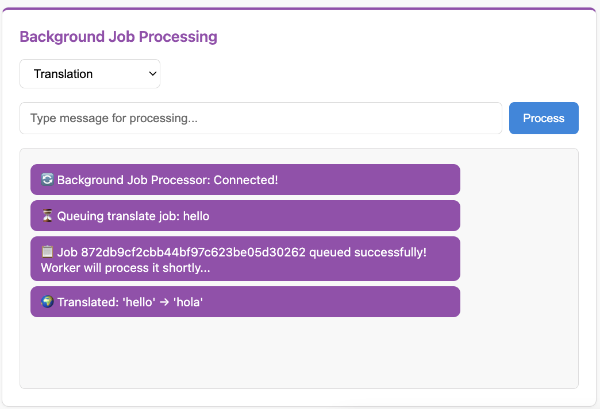

Part 3: Background Jobs with ARQ
=================================

In this part, you'll build a background job processing system using ARQ (Async Redis Queue). This demonstrates:

- Setting up ARQ workers
- WebSocket → Background Task → WebSocket flow
- Event handlers with ``@event_handler``
- Sending results to specific clients
- Running multiple services together

Understanding Background Jobs
------------------------------

The background job system works as follows:

1. **Client sends job request** via WebSocket
2. **Server queues job** with ARQ and sends "queued" status
3. **ARQ worker processes** job in the background (separate process)
4. **Worker sends result** back via channel layer to specific client
5. **WebSocket receives** and forwards result to client

This architecture offloads heavy work from WebSocket connections while keeping users updated in real-time.

Step 1: Define Message Types
-----------------------------

**Create** ``src/apps/background_jobs/__init__.py``:

.. code-block:: python

   # Background Jobs App - RQ-based async job processing

**Create** ``src/apps/background_jobs/messages.py``:

.. code-block:: python

   """
   Message types for the background jobs consumer.
   """

   from typing import Any, Literal

   from chanx.messages.base import BaseMessage
   from pydantic import BaseModel

   class JobPayload(BaseModel):
       type: str = "default"
       content: str

   class JobMessage(BaseMessage):
       """Background job message."""

       action: Literal["job"] = "job"
       payload: JobPayload

   class JobStatusMessage(BaseMessage):
       """Job status message."""

       action: Literal["job_status"] = "job_status"
       payload: dict[str, Any]

   class JobResult(BaseMessage):
       """Background job message."""

       action: Literal["job_result"] = "job_result"
       payload: Any

**Key points:**

- ``JobMessage`` - Client sends this to request a job
- ``JobStatusMessage`` - Server sends status updates (queuing, queued, result, error)
- ``JobResult`` - Workers send this via channel layer (handled by event handler)

Step 2: Create Background Tasks
--------------------------------

**Create** ``src/tasks.py`` with ARQ task definitions:

.. code-block:: python

   """
   ARQ-based background tasks for the application.
   """

   import asyncio
   import os
   import time
   from typing import Any

   from arq import create_pool
   from arq.connections import RedisSettings

   from src.apps.background_jobs.messages import JobResult
   from src.layers import setup_layers

   redis_url = os.getenv("REDIS_URL", "redis://localhost:6379")
   REDIS_SETTINGS = RedisSettings.from_dsn(redis_url)

   async def startup(ctx: dict[str, Any]) -> None:
       """Initialize resources when worker starts."""
       setup_layers()

   async def shutdown(ctx: dict[str, Any]) -> None:
       """Clean up resources when worker shuts down."""
       pass

   async def translate(
       ctx: dict[str, Any], job_id: str, content: str, channel_name: str
   ) -> dict[str, Any]:
       """Simulate text translation task."""
       await asyncio.sleep(2)  # Simulate processing

       translations = {
           "hello": "hola",
           "world": "mundo",
           "good morning": "buenos días",
           "thank you": "gracias",
       }

       translated = translations.get(content.lower(), f"[TRANSLATED: {content}]")
       result = f"🌍 Translated: '{content}' → '{translated}'"

       # Send result back through channel layer
       await _send_result_to_client(channel_name, result)

       return {"status": "completed", "result": result, "job_id": job_id}

   async def analyze(
       ctx: dict[str, Any], job_id: str, content: str, channel_name: str
   ) -> dict[str, Any]:
       """Simulate text analysis task."""
       await asyncio.sleep(3)

       word_count = len(content.split())
       char_count = len(content)
       vowel_count = sum(1 for char in content.lower() if char in "aeiou")

       result = (
           f"📊 Analysis of '{content}':\n"
           f"• Characters: {char_count}\n"
           f"• Words: {word_count}\n"
           f"• Vowels: {vowel_count}"
       )

       await _send_result_to_client(channel_name, result)
       return {"status": "completed", "result": result, "job_id": job_id}

   async def generate(
       ctx: dict[str, Any], job_id: str, content: str, channel_name: str
   ) -> dict[str, Any]:
       """Simulate AI response generation."""
       await asyncio.sleep(4)

       response = "That's an interesting point... Based on my analysis, I would suggest exploring this topic further."
       result = f"🤖 AI Response to '{content}':\n{response}"

       await _send_result_to_client(channel_name, result)
       return {"status": "completed", "result": result, "job_id": job_id}

   async def default(
       ctx: dict[str, Any], job_id: str, content: str, channel_name: str
   ) -> dict[str, Any]:
       """Default processing task."""
       await asyncio.sleep(1)
       result = f"✅ Processed: {content.upper()}"

       await _send_result_to_client(channel_name, result)
       return {"status": "completed", "result": result, "job_id": job_id}

   async def _send_result_to_client(channel_name: str, message: str) -> None:
       """Send result back to WebSocket client through channel layer."""
       try:
           from src.apps.background_jobs.consumer import BackgroundJobConsumer

           await BackgroundJobConsumer.send_event(JobResult(payload=message), channel_name)
       except Exception as e:
           print(f"Error sending result to client: {e}")

   JOB_FUNCTIONS = {
       "translate": translate,
       "analyze": analyze,
       "generate": generate,
       "default": default,
   }

   async def queue_job(job_type: str, content: str, channel_name: str) -> str:
       """Queue a background job and return the job ID."""
       if job_type not in JOB_FUNCTIONS:
           job_type = "default"

       redis = await create_pool(REDIS_SETTINGS)

       try:
           job_id = f"{job_type}_{int(time.time())}"
           job = await redis.enqueue_job(job_type, job_id, content, channel_name)
           return job.job_id if job else job_id
       finally:
           await redis.aclose()

   class WorkerSettings:
       """ARQ Worker settings."""

       functions = [translate, analyze, generate, default]
       on_startup = startup
       on_shutdown = shutdown
       redis_settings = REDIS_SETTINGS
       max_jobs = 10
       job_timeout = 300  # 5 minutes
       keep_result = 3600  # Keep results for 1 hour

**Understanding the tasks:**

**ARQ task functions:**

All ARQ tasks must be async functions with this signature:

.. code-block:: python

   async def task_name(ctx: dict[str, Any], job_id: str, content: str, channel_name: str):
       # Process the job
       await asyncio.sleep(2)  # Simulate work

       # Send result back to client
       await _send_result_to_client(channel_name, result)

       return {"status": "completed", "result": result}

- ``ctx`` - Shared context dictionary (can store connections, etc.)
- ``job_id`` - Unique identifier for this job
- ``content`` - Data to process
- ``channel_name`` - WebSocket channel to send result to

**Sending results:**

.. code-block:: python

   await BackgroundJobConsumer.send_event(JobResult(payload=message), channel_name)

Uses ``send_event()`` to send a message to a **specific WebSocket client** identified by ``channel_name``. The consumer's ``@event_handler`` receives this and forwards it to the client.

**queue_job() helper:**

.. code-block:: python

   async def queue_job(job_type: str, content: str, channel_name: str) -> str:
       redis = await create_pool(REDIS_SETTINGS)
       job = await redis.enqueue_job(job_type, job_id, content, channel_name)
       return job.job_id

Creates an ARQ connection pool, enqueues the job, and returns the job ID.

**WorkerSettings:**

.. code-block:: python

   class WorkerSettings:
       functions = [translate, analyze, generate, default]
       on_startup = startup
       on_shutdown = shutdown
       redis_settings = REDIS_SETTINGS

ARQ discovers this class to configure the worker. Lists all available task functions and their settings.

Step 3: Create Background Jobs Consumer
----------------------------------------

**Create** ``src/apps/background_jobs/consumer.py``:

.. code-block:: python

   """
   Background Jobs Consumer - Real background job processing with ARQ.
   """

   from chanx.core.decorators import channel, event_handler, ws_handler
   from chanx.messages.incoming import PingMessage
   from chanx.messages.outgoing import PongMessage

   from src.base_consumer import BaseConsumer
   from src.tasks import queue_job

   from .messages import JobMessage, JobResult, JobStatusMessage

   @channel(
       name="background_jobs",
       description="Background Jobs Consumer - Real background job processing with ARQ",
       tags=["jobs", "background", "arq"],
   )
   class BackgroundJobConsumer(BaseConsumer[JobResult]):
       """Consumer for processing messages with real background jobs using ARQ."""

       channel_layer_alias = "chat"

       @ws_handler(
           summary="Handle ping requests",
           description="Simple ping-pong for connectivity testing",
       )
       async def handle_ping(self, _message: PingMessage) -> PongMessage:
           return PongMessage()

       @ws_handler(
           summary="Handle job processing requests",
           description="Process job requests by queuing them with ARQ",
           output_type=JobStatusMessage,
       )
       async def handle_job(self, message: JobMessage) -> None:
           """Handle incoming job messages."""
           try:
               job_type = message.payload.type
               content = message.payload.content

               # Show immediate response that job is being queued
               await self.send_message(
                   JobStatusMessage(
                       payload={
                           "status": "queuing",
                           "message": f"⏳ Queuing {job_type} job: {content}",
                       }
                   )
               )

               # Queue the real background job
               job_id = await queue_job(job_type, content, self.channel_name)

               await self.send_message(
                   JobStatusMessage(
                       payload={
                           "status": "queued",
                           "job_id": job_id,
                           "message": f"📋 Job {job_id} queued successfully!",
                       }
                   )
               )

           except Exception as e:
               await self.send_message(
                   JobStatusMessage(
                       payload={
                           "status": "error",
                           "message": f"❌ Error queuing job: {str(e)}",
                       }
                   )
               )

       async def post_authentication(self) -> None:
           """Send connection established message."""
           await self.send_message(
               JobStatusMessage(
                   payload={
                       "status": "connected",
                       "message": "🔄 Background Job Processor: Connected!",
                   }
               )
           )

       @event_handler
       async def handle_job_result(self, event: JobResult) -> JobStatusMessage:
           """Handle job results sent back from background workers."""
           return JobStatusMessage(payload={"status": "result", "message": event.payload})

**Understanding the consumer:**

**Generic type parameter (optional but recommended):**

.. code-block:: python

   class BackgroundJobConsumer(BaseConsumer[JobResult]):

The ``[JobResult]`` type parameter is **not required** - your consumer will work fine without it. However, it's nice to have because:

- **Type safety**: IDE and type checkers (mypy/pyright) will warn if you try to send the wrong event type
- **Team protection**: Prevents you or teammates from accidentally using ``send_event()`` or ``broadcast_event()`` with incorrect message types
- **Better autocomplete**: IDE knows which event types this consumer accepts

.. code-block:: python

   # With type parameter - type checker catches errors:
   BackgroundJobConsumer.send_event(JobResult(...), channel_name)  # ✅ OK
   BackgroundJobConsumer.send_event(WrongMessage(...), channel_name)  # ❌ Type error!

   # Without type parameter - no compile-time checking:
   BackgroundJobConsumer.send_event(WrongMessage(...), channel_name)  # No error (until runtime)

If you don't specify it, just use ``BaseConsumer`` without the brackets.

**Queueing jobs:**

.. code-block:: python

   @ws_handler(output_type=JobStatusMessage)
   async def handle_job(self, message: JobMessage) -> None:
       # Send "queuing" status
       await self.send_message(JobStatusMessage(...))

       # Queue the job
       job_id = await queue_job(job_type, content, self.channel_name)

       # Send "queued" status
       await self.send_message(JobStatusMessage(...))

The handler sends multiple status messages to keep the client informed. It passes ``self.channel_name`` so the worker knows where to send results.

**Event handler:**

.. code-block:: python

   @event_handler
   async def handle_job_result(self, event: JobResult) -> JobStatusMessage:
       return JobStatusMessage(payload={"status": "result", "message": event.payload})

This receives ``JobResult`` messages sent from ARQ workers via the channel layer. It transforms the event into a ``JobStatusMessage`` and returns it, which sends it to the WebSocket client.

Understanding Event Handlers
~~~~~~~~~~~~~~~~~~~~~~~~~~~~

This is the first time we're using ``@event_handler``, so let's understand what it does and how it differs from ``@ws_handler``.

**@ws_handler vs @event_handler:**

.. code-block:: python

   # Receives messages from WebSocket clients
   @ws_handler
   async def handle_user_message(self, message: UserMessage) -> Response:
       ...

   # Receives messages from channel layer (server-to-server)
   @event_handler
   async def handle_job_result(self, event: JobResult) -> Response:
       ...

**Key differences:**

+------------------+------------------------------------+--------------------------------------------+
|                  | @ws_handler                        | @event_handler                             |
+==================+====================================+============================================+
| **Source**       | WebSocket clients                  | Channel layer (server-side)                |
+------------------+------------------------------------+--------------------------------------------+
| **Triggered by** | Client sends JSON message          | ``send_event()`` or ``broadcast_event()``  |
+------------------+------------------------------------+--------------------------------------------+
| **Use case**     | Handle user interactions           | Handle background job results, external    |
|                  |                                    | triggers, cross-consumer messages          |
+------------------+------------------------------------+--------------------------------------------+

**How event handlers work:**

**Pattern 1: Return value sends to WebSocket client**

.. code-block:: python

   @event_handler
   async def handle_job_result(self, event: JobResult) -> JobStatusMessage:
       # What you return is sent to the WebSocket client
       return JobStatusMessage(payload={"status": "result", "message": event.payload})

Where the message goes depends on how the event was sent:

- ``send_event(message, channel_name)`` → goes to **one specific client**
- ``broadcast_event(message, groups=[...])`` → goes to **all clients in those groups**

In our background jobs example:

.. code-block:: python

   # Worker sends to specific client
   await BackgroundJobConsumer.send_event(JobResult(payload=result), channel_name)

   # Event handler receives it and forwards to that client
   @event_handler
   async def handle_job_result(self, event: JobResult) -> JobStatusMessage:
       return JobStatusMessage(payload={"status": "result", "message": event.payload})

**Pattern 2: Send multiple messages or complex logic**

.. code-block:: python

   @event_handler(output_type=Notification)
   async def handle_complex_event(self, event: ComplexEvent) -> None:
       # Send multiple messages
       await self.send_message(Notification(payload="Processing..."))
       await self.send_message(Notification(payload="Complete!"))

When using complex logic:

- Return type is ``None``
- Use ``output_type`` parameter for API documentation
- Call ``send_message()`` or ``broadcast_message()`` explicitly

**Why use event handlers?**

Event handlers enable server-to-server communication:

- **Background workers** can send results back to WebSocket clients
- **External scripts** can trigger WebSocket notifications
- **HTTP endpoints** can push messages to WebSocket connections
- **Different consumers** can send messages to each other

This is more powerful than ``@ws_handler`` which only handles client messages.

Step 4: Register the WebSocket Route
-------------------------------------

**Edit** ``src/main.py`` and uncomment the background jobs code:

.. code-block:: python

   # Uncomment:
   from src.apps.background_jobs.consumer import (
       BackgroundJobConsumer,  # ARQ background jobs
   )

   # ... later:
   ws_router.add_websocket_route(
       "/background_jobs", BackgroundJobConsumer.as_asgi()
   )  # ARQ background job processing

Step 5: Create Development Script (Optional)
---------------------------------------------

To make development easier, create a script that runs both FastAPI and ARQ worker together.

**Create** ``src/start_dev.py``:

.. code-block:: python

   #!/usr/bin/env python3
   """
   Development startup script that runs both FastAPI app and ARQ worker.

   Usage:
       python src/start_dev.py

   This will start:
   1. ARQ worker in the background
   2. FastAPI application with live reload

   Both processes will be managed together and stopped with Ctrl+C.
   """

   import signal
   import subprocess
   import sys
   import time
   from pathlib import Path
   from types import FrameType

   import uvicorn

   # Ensure project root is in Python path
   project_root = Path(__file__).parent.parent
   if str(project_root) not in sys.path:
       sys.path.insert(0, str(project_root))

   def main() -> None:
       """Start both worker and FastAPI app."""
       print("🚀 Starting development environment...")

       # Store process references
       worker_process = None

       def cleanup(signum: int | None = None, frame: FrameType | None = None) -> None:
           """Clean up processes on exit."""
           print("\n🛑 Shutting down...")

           if worker_process:
               print("🔄 Stopping ARQ worker...")
               worker_process.terminate()
               try:
                   worker_process.wait(timeout=5)
               except subprocess.TimeoutExpired:
                   worker_process.kill()

           print("✅ Shutdown complete")
           sys.exit(0)

       # Set up signal handlers
       signal.signal(signal.SIGINT, cleanup)
       signal.signal(signal.SIGTERM, cleanup)

       try:
           # Start ARQ worker
           print("🔄 Starting ARQ worker...")
           worker_process = subprocess.Popen(
               [sys.executable, "-m", "arq", "src.tasks.WorkerSettings"]
           )

           # Give worker a moment to start
           time.sleep(2)

           # Start FastAPI app
           print("🌐 Starting FastAPI application...")
           uvicorn.run("src.main:app", host="0.0.0.0", port=8000, reload=True)

           print("\n✅ Development environment ready!")
           print("📱 FastAPI app: http://localhost:8000")
           print("🔄 ARQ worker: running in background")
           print("🛑 Press Ctrl+C to stop both services")

       except KeyboardInterrupt:
           pass
       except Exception as e:
           print(f"❌ Error: {e}")
       finally:
           cleanup()

   if __name__ == "__main__":
       main()

This script:

- Starts the ARQ worker in the background
- Starts the FastAPI application with live reload
- Manages both processes together
- Handles Ctrl+C gracefully to stop both services

Step 6: Test Background Jobs
-----------------------------

**1. Ensure Redis is running:**

.. code-block:: bash

   docker compose up -d

**2. Start the services:**

You have two options:

**Option A: Use the development script (recommended):**

.. code-block:: bash

   python src/start_dev.py

This starts both the ARQ worker and FastAPI server in one command, making development easier.

**Option B: Run services separately:**

If you prefer to see logs separately, open two terminals:

**Terminal 1 - ARQ worker:**

.. code-block:: bash

   arq src.tasks.WorkerSettings

You should see:

.. code-block:: text

   Worker started
   Listening on default queue

**Terminal 2 - FastAPI server:**

.. code-block:: bash

   uvicorn src.main:app --reload

**3. Open the application:**

Visit http://localhost:8000 and navigate to the Background Jobs page.

**4. Submit jobs:**

The page auto-connects. Select a job type and enter content:

- **translate** - Try "hello", "world", "good morning"
- **analyze** - Any text to see character/word analysis
- **generate** - Any text for AI-like responses

Click "Submit Job" and you should see:

1. **Immediate**: "⏳ Queuing translate job: hello"
2. **Immediate**: "📋 Job translate_xxx queued successfully!"
3. **After 1-4 seconds**: "🌍 Translated: 'hello' → 'hola'"

The screenshot shows the complete job flow: connection established → queuing → queued → translated result.

**5. Watch the worker (if running separately):**

If you used Option B (two terminals), check the ARQ worker terminal to see:

.. code-block:: text

   [timestamp] Job started: translate
   [timestamp] Job complete: translate

**6. Test multiple jobs:**

Submit several jobs simultaneously - ARQ processes them (potentially in parallel based on ``max_jobs`` setting).

Understanding the Flow
-----------------------

**Complete flow when client submits a job:**

1. **Client → WebSocket:**

   .. code-block:: json

      {"action": "job", "payload": {"type": "translate", "content": "hello"}}

2. **WebSocket handler:**

   - Sends "queuing" status to client
   - Calls ``queue_job()`` → adds to ARQ queue with ``channel_name``
   - Sends "queued" status to client

3. **ARQ worker (separate process):**

   - Picks up job from Redis queue
   - Executes ``translate()`` function
   - Calls ``BackgroundJobConsumer.send_event(JobResult(...), channel_name)``

4. **Channel layer:**

   - Routes ``JobResult`` to specific ``channel_name``

5. **Event handler:**

   - Receives ``JobResult``
   - Returns ``JobStatusMessage``
   - Automatically sent to WebSocket client

6. **Client receives result:**

   .. code-block:: json

      {"action": "job_status", "payload": {"status": "result", "message": "🌍 Translated: ..."}}

Key Concepts Review
-------------------

**ARQ Setup:**

- Async task functions with ``ctx`` parameter
- ``WorkerSettings`` class for configuration
- ``on_startup`` / ``on_shutdown`` hooks

**Event Handlers:**

- Use ``@event_handler`` decorator
- Receive messages from channel layer (not WebSocket)
- Routing depends on how event was sent (``send_event`` vs ``broadcast_event``)

**Sending to Specific Clients:**

- ``send_event(message, channel_name)`` - Send to one client
- Worker stores ``channel_name`` when job is queued
- Uses channel layer to route message back

**Generic Type Parameter:**

- ``BaseConsumer[EventType]`` - Type-safe event handling
- Better IDE support and type checking
- Optional but recommended

What's Next?
------------

You've built a background job processing system! You now understand:

- ✅ ARQ worker setup and configuration
- ✅ WebSocket → Background Task → WebSocket flow
- ✅ Event handlers with ``@event_handler``
- ✅ Sending messages to specific clients
- ✅ Running multiple services together

In the next part, you'll explore multi-layer messaging with:

- External scripts sending WebSocket messages
- HTTP endpoints triggering WebSocket notifications
- Cross-consumer communication

.. toctree::
   :maxdepth: 1

   cp4-multi-layer
