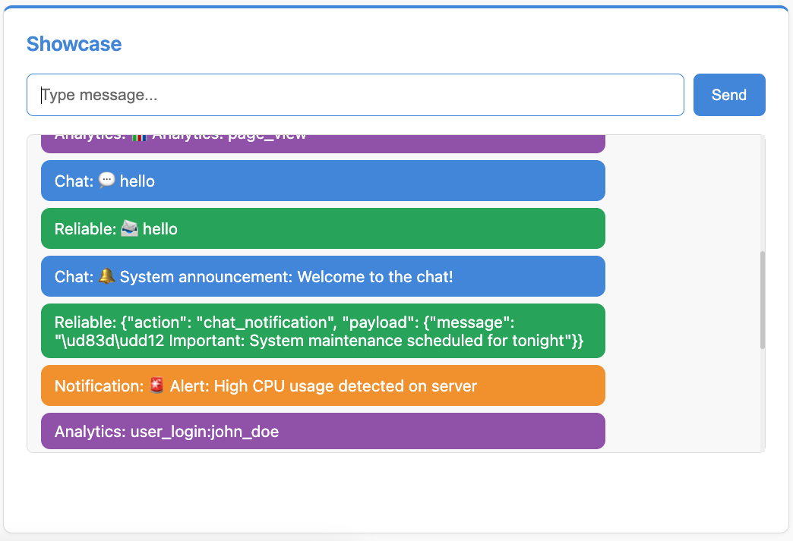
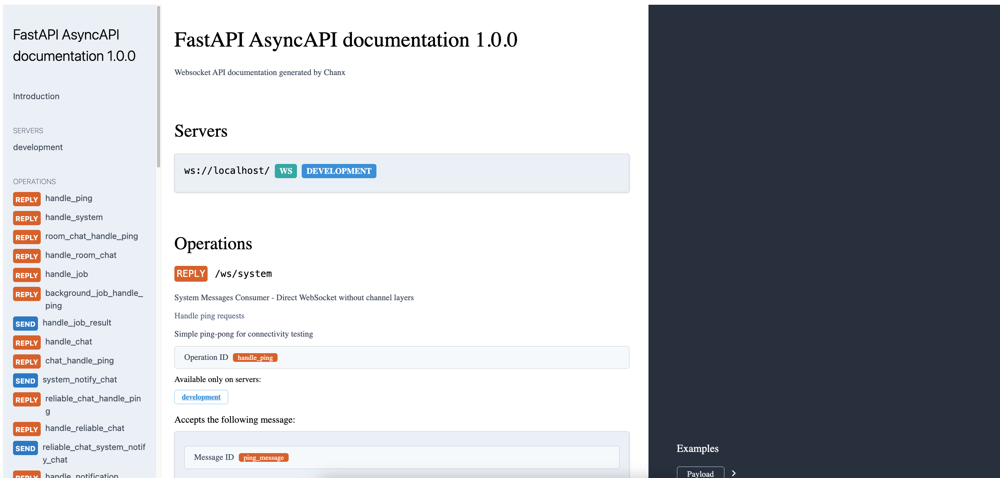

Part 4: Multi-Layer WebSocket Showcase
=======================================

In this part, you'll explore how multiple channel layer types work together in one application. This demonstrates:

- Using different channel layer types for different purposes
- External scripts sending WebSocket messages
- Broadcasting to multiple consumer groups
- Choosing the right layer for your use case

Understanding Multi-Layer Architecture
---------------------------------------

We configured five channel layers in Part 2 (``src/layers.py``). Now we'll use four of them simultaneously:

+-------------------+----------------------+------------------+---------------------------------------+
| Layer             | Type                 | Use Case         | Consumer                              |
+===================+======================+==================+=======================================+
| ``chat``          | RedisPubSub          | Real-time chat   | ChatConsumer                          |
+-------------------+----------------------+------------------+---------------------------------------+
| ``queue``         | Redis (Queue)        | Reliable         | ReliableChatConsumer                  |
|                   |                      | messaging        |                                       |
+-------------------+----------------------+------------------+---------------------------------------+
| ``notifications`` | RedisPubSub          | Push             | NotificationConsumer                  |
|                   |                      | notifications    |                                       |
+-------------------+----------------------+------------------+---------------------------------------+
| ``analytics``     | Redis (Queue)        | Event tracking   | AnalyticsConsumer                     |
+-------------------+----------------------+------------------+---------------------------------------+

**Why use different layers?**

- **Pub/Sub** (``RedisPubSubChannelLayer``) - Fast, real-time, no message persistence
- **Queue** (``RedisChannelLayer``) - Reliable, messages queued with expiry, guaranteed delivery

Step 1: Define Message Types
-----------------------------

**Create** ``src/apps/showcase/__init__.py``:

.. code-block:: python

   # Showcase App - Demonstrates all channel layer types working together

**Create** ``src/apps/showcase/messages.py``:

.. code-block:: python

   """
   Message types for the showcase consumers.
   """

   from typing import Any, Literal

   from chanx.messages.base import BaseMessage
   from pydantic import BaseModel

   # Chat messages
   class ChatPayload(BaseModel):
       message: str

   class ChatMessage(BaseMessage):
       action: Literal["chat"] = "chat"
       payload: ChatPayload

   class ChatNotificationMessage(BaseMessage):
       action: Literal["chat_notification"] = "chat_notification"
       payload: ChatPayload

   # Reliable chat messages
   class ReliableChatPayload(BaseModel):
       message: str

   class ReliableChatMessage(BaseMessage):
       action: Literal["reliable_chat"] = "reliable_chat"
       payload: ReliableChatPayload

   class ReliableChatNotificationMessage(BaseMessage):
       action: Literal["reliable_chat_notification"] = "reliable_chat_notification"
       payload: ReliableChatPayload

   # Notification messages
   class NotificationPayload(BaseModel):
       type: str = "user"
       message: str

   class NotificationMessage(BaseMessage):
       action: Literal["notification"] = "notification"
       payload: NotificationPayload

   class NotificationBroadcastMessage(BaseMessage):
       action: Literal["notification_broadcast"] = "notification_broadcast"
       payload: NotificationPayload

   # Analytics messages
   class AnalyticsPayload(BaseModel):
       event: str
       data: Any = None

   class AnalyticsMessage(BaseMessage):
       action: Literal["analytics"] = "analytics"
       payload: AnalyticsPayload

   class AnalyticsNotificationMessage(BaseMessage):
       action: Literal["analytics_notification"] = "analytics_notification"
       payload: AnalyticsPayload

   # External event messages
   class SystemNotify(BaseMessage):
       action: Literal["system_notify"] = "system_notify"
       payload: str

   class SystemPeriodicNotify(BaseMessage):
       action: Literal["system_periodic_notify"] = "system_periodic_notify"
       payload: str

Each consumer has its own message types, plus two shared event types (``SystemNotify``, ``SystemPeriodicNotify``) for external messaging.

Step 2: Create Showcase Consumers
----------------------------------

**Create** ``src/apps/showcase/consumer.py`` with four consumers:

.. code-block:: python

   """
   Showcase Consumers - Different channel layer types working together.
   """

   from chanx.core.decorators import channel, event_handler, ws_handler
   from chanx.messages.incoming import PingMessage
   from chanx.messages.outgoing import PongMessage
   from fast_channels.type_defs import WebSocketDisconnectEvent

   from src.base_consumer import BaseConsumer

   from .messages import (
       AnalyticsMessage,
       AnalyticsNotificationMessage,
       AnalyticsPayload,
       ChatMessage,
       ChatNotificationMessage,
       ChatPayload,
       NotificationBroadcastMessage,
       NotificationMessage,
       NotificationPayload,
       ReliableChatMessage,
       ReliableChatNotificationMessage,
       ReliableChatPayload,
       SystemNotify,
       SystemPeriodicNotify,
   )

   @channel(
       name="chat",
       description="Basic Chat Consumer using centralized chat layer",
       tags=["chat", "showcase"],
   )
   class ChatConsumer(BaseConsumer[SystemNotify]):
       """Chat consumer using the centralized chat layer."""

       groups = ["chat_room"]
       channel_layer_alias = "chat"

       @ws_handler(
           summary="Handle ping requests",
           description="Simple ping-pong for connectivity testing",
       )
       async def handle_ping(self, _message: PingMessage) -> PongMessage:
           return PongMessage()

       @ws_handler(
           summary="Handle chat messages",
           description="Process chat messages and broadcast to room",
           output_type=ChatNotificationMessage,
       )
       async def handle_chat(self, message: ChatMessage) -> None:
           await self.broadcast_message(
               ChatNotificationMessage(
                   payload=ChatPayload(message=f"💬 {message.payload.message}"),
               ),
           )

       async def post_authentication(self) -> None:
           await self.broadcast_message(
               ChatNotificationMessage(
                   payload=ChatPayload(message="📢 Someone joined the chat")
               ),
           )

       async def websocket_disconnect(self, message: WebSocketDisconnectEvent) -> None:
           await self.broadcast_message(
               ChatNotificationMessage(
                   payload=ChatPayload(message="❌ Someone left the chat.")
               ),
           )
           await super().websocket_disconnect(message)

       @event_handler
       async def system_notify_chat(self, event: SystemNotify) -> ChatNotificationMessage:
           return ChatNotificationMessage(
               payload=ChatPayload(message=event.payload),
           )

   @channel(
       name="reliable_chat",
       description="Reliable Chat Consumer using queue-based layer",
       tags=["chat", "reliable", "showcase"],
   )
   class ReliableChatConsumer(BaseConsumer[SystemNotify]):
       """Chat consumer using queue-based layer for guaranteed delivery."""

       channel_layer_alias = "queue"
       groups = ["reliable_chat"]

       @ws_handler(
           summary="Handle ping requests",
           description="Simple ping-pong for connectivity testing",
       )
       async def handle_ping(self, _message: PingMessage) -> PongMessage:
           return PongMessage()

       @ws_handler(
           summary="Handle reliable chat messages",
           description="Process reliable chat messages with guaranteed delivery",
           output_type=ReliableChatNotificationMessage,
       )
       async def handle_reliable_chat(self, message: ReliableChatMessage) -> None:
           await self.broadcast_message(
               ReliableChatNotificationMessage(
                   payload=ReliableChatPayload(message=f"📨 {message.payload.message}")
               ),
               groups=["reliable_chat"],
           )

       async def post_authentication(self) -> None:
           await self.broadcast_message(
               ReliableChatNotificationMessage(
                   payload=ReliableChatPayload(
                       message="🔒 Reliable chat connection established!"
                   )
               ),
               groups=["reliable_chat"],
           )

       async def websocket_disconnect(self, message: WebSocketDisconnectEvent) -> None:
           await self.broadcast_message(
               ReliableChatNotificationMessage(
                   payload=ReliableChatPayload(message="🚪 Left reliable chat!")
               ),
               groups=["reliable_chat"],
           )
           await super().websocket_disconnect(message)

       @event_handler
       async def system_notify_chat(self, event: SystemNotify) -> ChatNotificationMessage:
           return ChatNotificationMessage(
               payload=ChatPayload(message=event.payload),
           )

   @channel(
       name="notifications",
       description="Notification Consumer for real-time notifications",
       tags=["notifications", "showcase"],
   )
   class NotificationConsumer(BaseConsumer):
       """Consumer for real-time notifications."""

       channel_layer_alias = "notifications"
       groups = ["notifications"]

       @ws_handler(
           summary="Handle ping requests",
           description="Simple ping-pong for connectivity testing",
       )
       async def handle_ping(self, _message: PingMessage) -> PongMessage:
           return PongMessage()

       @ws_handler(
           summary="Handle notification messages",
           description="Process notification messages and broadcast to all clients",
           output_type=NotificationBroadcastMessage,
       )
       async def handle_notification(self, message: NotificationMessage) -> None:
           await self.broadcast_message(
               NotificationBroadcastMessage(
                   payload=NotificationPayload(
                       type="user",
                       message=f"🔔 Notification: {message.payload.message}",
                   )
               ),
           )

       async def post_authentication(self) -> None:
           await self.broadcast_message(
               NotificationBroadcastMessage(
                   payload=NotificationPayload(
                       type="system", message="🔔 Connected to notifications!"
                   )
               ),
           )

       @event_handler
       async def system_notify_notification(
           self, event: SystemNotify
       ) -> NotificationBroadcastMessage:
           return NotificationBroadcastMessage(
               payload=NotificationPayload(type="system", message=event.payload)
           )

       @event_handler
       async def system_notify_periodic_notification(
           self, event: SystemPeriodicNotify
       ) -> NotificationBroadcastMessage:
           return NotificationBroadcastMessage(
               payload=NotificationPayload(type="periodic", message=event.payload)
           )

   @channel(
       name="analytics",
       description="Analytics Consumer for reliable event delivery",
       tags=["analytics", "showcase"],
   )
   class AnalyticsConsumer(BaseConsumer[SystemNotify]):
       """Consumer for analytics events with reliable delivery."""

       channel_layer_alias = "analytics"
       groups = ["analytics"]

       @ws_handler(
           summary="Handle ping requests",
           description="Simple ping-pong for connectivity testing",
       )
       async def handle_ping(self, _message: PingMessage) -> PongMessage:
           return PongMessage()

       @ws_handler(
           summary="Handle analytics events",
           description="Process analytics events with reliable delivery",
           output_type=AnalyticsNotificationMessage,
       )
       async def handle_analytics(self, message: AnalyticsMessage) -> None:
           await self.broadcast_message(
               AnalyticsNotificationMessage(
                   payload=AnalyticsPayload(
                       event=f"📊 Analytics: {message.payload.event}",
                       data=message.payload.data,
                   )
               ),
           )

       @event_handler
       async def system_notify_analytic(
           self, event: SystemNotify
       ) -> AnalyticsNotificationMessage:
           return AnalyticsNotificationMessage(
               payload=AnalyticsPayload(
                   event=f"{event.payload}",
               )
           )

**Key points:**

Each consumer uses a different channel layer (``channel_layer_alias``):

- **ChatConsumer**: ``"chat"`` layer (Pub/Sub)
- **ReliableChatConsumer**: ``"queue"`` layer (Queue-based)
- **NotificationConsumer**: ``"notifications"`` layer (Pub/Sub)
- **AnalyticsConsumer**: ``"analytics"`` layer (Queue-based)

All consumers have event handlers to receive external messages (``SystemNotify`` events).

Step 3: Create External Sender Script
--------------------------------------

This script demonstrates sending messages to WebSocket clients from outside a consumer.

**Create** ``src/external_sender.py``:

.. code-block:: python

   """
   Example of sending messages to WebSocket groups from outside a consumer.
   """

   import asyncio

   from fast_channels.layers.registry import channel_layers

   from src.apps.showcase.consumer import (
       AnalyticsConsumer,
       ChatConsumer,
       NotificationConsumer,
       ReliableChatConsumer,
   )
   from src.apps.showcase.messages import SystemNotify, SystemPeriodicNotify
   from src.layers import setup_layers

   if len(channel_layers) == 0:
       setup_layers()

   async def send_chat_message() -> None:
       """Send a message to the chat room using the chat layer."""
       await ChatConsumer.broadcast_event(
           SystemNotify(payload="🔔 System announcement: Welcome to the chat!")
       )

       print("✅ Chat message sent!")

   async def send_reliable_message() -> None:
       """Send a message using the queue-based layer for guaranteed delivery."""
       await ReliableChatConsumer.broadcast_event(
           SystemNotify(payload="🔒 Important: System maintenance scheduled for tonight"),
       )

       print("✅ Reliable message sent!")

   async def send_notification() -> None:
       """Send a notification using the notifications layer."""
       await NotificationConsumer.broadcast_event(
           SystemNotify(payload="🚨 Alert: High CPU usage detected on server")
       )

       print("✅ Notification sent!")

   async def send_analytics_event() -> None:
       """Send analytics events using the analytics layer."""
       events = [
           "user_login:john_doe",
           "page_view:/dashboard",
           "button_click:export_data",
           "session_duration:1234",
           "error:api_timeout",
       ]

       for event in events:
           await AnalyticsConsumer.broadcast_event(
               SystemNotify(payload=event),
           )
           await asyncio.sleep(0.1)

       print(f"✅ Sent {len(events)} analytics events!")

   async def periodic_announcements() -> None:
       """Send periodic announcements to different channels."""
       print("⏰ Starting periodic announcements...")
       for i in range(3):
           if i % 2 == 0:
               message = f"⏰ Hourly chat announcement #{i+1}"
               await ChatConsumer.broadcast_event(
                   SystemNotify(payload=message),
               )
           else:
               message = f"🔔 System status update #{i+1}"
               await NotificationConsumer.broadcast_event(
                   SystemPeriodicNotify(payload=message),
               )

           print(f"✅ Sent announcement #{i+1}")
           await asyncio.sleep(1)

       print("✅ Periodic announcements complete!")

   async def main() -> None:
       """Run all external messaging examples."""
       print("=== External Messaging with Centralized Layers ===\n")

       examples = [
           ("Chat Message", send_chat_message),
           ("Reliable Message", send_reliable_message),
           ("Notification", send_notification),
           ("Analytics Events", send_analytics_event),
           ("Periodic Announcements", periodic_announcements),
       ]

       for name, func in examples:
           print(f"🎯 Running: {name}")
           try:
               await func()
           except Exception as e:
               print(f"❌ Error in {name}: {e}")
           print()
           await asyncio.sleep(0.5)

       print("=== All Examples Complete! ===")

   if __name__ == "__main__":
       asyncio.run(main())

**How external messaging works:**

.. code-block:: python

   # Send to all clients in ChatConsumer's groups
   await ChatConsumer.broadcast_event(
       SystemNotify(payload="Message from external script")
   )

   # Event handler in ChatConsumer receives and forwards to WebSocket
   @event_handler
   async def system_notify_chat(self, event: SystemNotify) -> ChatNotificationMessage:
       return ChatNotificationMessage(payload=ChatPayload(message=event.payload))

**Use cases for external messaging:**

- **HTTP endpoints** trigger WebSocket notifications
- **Background scripts** send periodic updates
- **Cron jobs** broadcast scheduled messages
- **Monitoring systems** alert connected clients

Step 4: Register Routes
------------------------

**Edit** ``src/main.py`` and uncomment the showcase consumers:

.. code-block:: python

   # Uncomment:
   from src.apps.showcase.consumer import (
       AnalyticsConsumer,
       ChatConsumer,
       NotificationConsumer,
       ReliableChatConsumer,
   )

   # ... later:
   ws_router.add_websocket_route("/chat", ChatConsumer.as_asgi())
   ws_router.add_websocket_route("/reliable", ReliableChatConsumer.as_asgi())
   ws_router.add_websocket_route("/notifications", NotificationConsumer.as_asgi())
   ws_router.add_websocket_route("/analytics", AnalyticsConsumer.as_asgi())

Step 5: Test Multi-Layer System
--------------------------------

**1. Start Redis:**

.. code-block:: bash

   docker compose up -d

**2. Start the server:**

.. code-block:: bash

   uvicorn src.main:app --reload

**3. Open the showcase page:**

Visit http://localhost:8000 and navigate to the Showcase page. The page connects to all four consumers simultaneously, displaying messages from each in a unified interface:

- **Reliable** - Queue-based chat messages
- **Chat** - Pub/Sub chat messages
- **Notification** - Real-time notifications
- **Analytics** - Analytics events

**4. Test messaging:**

Type a message and click Send. You'll see responses from:

- **Chat** - Echo from the Pub/Sub chat layer
- **Reliable** - Echo from the queue-based reliable chat layer

The Notification and Analytics consumers don't echo user messages - they only respond to external events (which we'll test next).

The screenshot shows the unified showcase interface with messages from Analytics, Chat, Reliable, and Notification consumers.

**5. Test external messaging:**

In a new terminal, run the external sender:

.. code-block:: bash

   python -m src.external_sender

You should see messages appear in the corresponding browser tabs:

- Chat tab receives: "🔔 System announcement: Welcome to the chat!"
- Reliable chat tab receives: "🔒 Important: System maintenance..."
- Notifications tab receives: "🚨 Alert: High CPU usage..."
- Analytics tab receives multiple events
- Periodic announcements alternate between chat and notifications

**6. Create your own external sender:**

.. code-block:: python

   # send_custom.py
   import asyncio
   from src.apps.showcase.consumer import ChatConsumer
   from src.apps.showcase.messages import SystemNotify
   from src.layers import setup_layers

   async def main():
       setup_layers()
       await ChatConsumer.broadcast_event(
           SystemNotify(payload="Custom message!")
       )
       print("Message sent!")

   asyncio.run(main())

Understanding Channel Layer Selection
--------------------------------------

**When to use Pub/Sub (RedisPubSubChannelLayer):**

- Real-time chat
- Live notifications
- Ephemeral data
- High message volume
- Don't need persistence

**When to use Queue (RedisChannelLayer):**

- Important messages that must be delivered
- Background job results
- Analytics/metrics
- Messages with expiry
- Need reliability over speed

**Example from our showcase:**

- **Chat** (Pub/Sub) - Messages are ephemeral, speed is important
- **Reliable Chat** (Queue) - Messages must be delivered, queued if client disconnects
- **Notifications** (Pub/Sub) - Real-time alerts, can be missed
- **Analytics** (Queue) - Events must not be lost, queued for processing

Viewing AsyncAPI Documentation
--------------------------------

Now that you've built all the consumers, you can view the complete AsyncAPI documentation that Chanx automatically generates.

Visit http://localhost:8000/asyncapi/ to see your entire WebSocket API documented:

The AsyncAPI documentation automatically generates from your consumer decorators and message types, showing:

- All WebSocket endpoints (``/ws/system``, ``/ws/room/{room_name}``, ``/ws/background_jobs``, ``/ws/chat``, etc.)
- Available operations (handlers) for each consumer
- Message schemas with Pydantic validation rules
- Request and response message types

This documentation updates automatically as you add or modify consumers, keeping your API docs always in sync with your code.

Key Concepts Review
-------------------

**Multi-Layer Architecture:**

- Different consumers can use different channel layers
- Each layer has specific trade-offs (speed vs reliability)
- Layers are configured once in ``layers.py``

**External Messaging:**

- ``Consumer.broadcast_event()`` - Send from anywhere to WebSocket clients
- Event handlers receive and forward to clients
- Enables HTTP → WebSocket, scripts → WebSocket

**Channel Layer Types:**

- **Pub/Sub**: Fast, real-time, no persistence
- **Queue**: Reliable, queued, with expiry

What's Next?
------------

You've explored the multi-layer showcase! You now understand:

- ✅ Using different channel layers for different purposes
- ✅ External scripts sending to WebSocket clients
- ✅ Cross-layer communication
- ✅ Choosing the right layer for your use case

In the final part, you'll learn comprehensive WebSocket testing with pytest.

.. toctree::
   :maxdepth: 1

   cp5-testing
