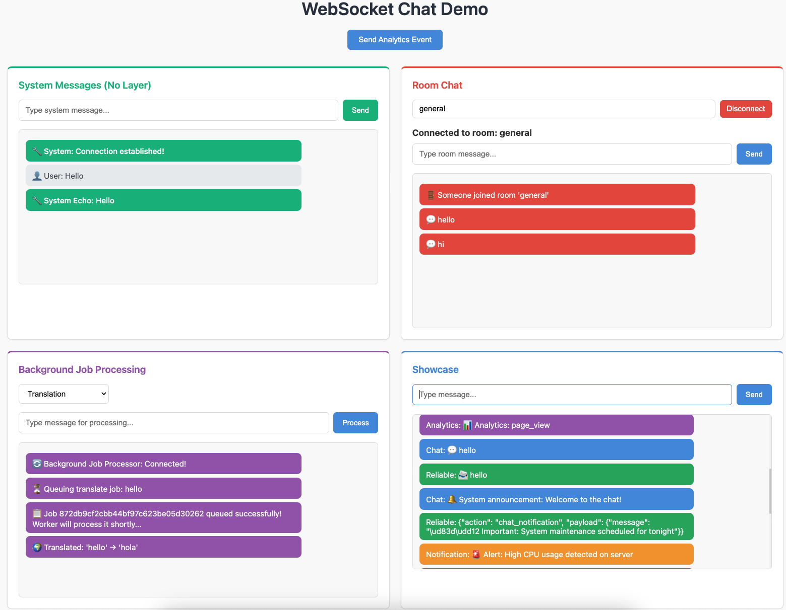

FastAPI Tutorial: Prerequisites
================================

Welcome to the Chanx FastAPI tutorial! This hands-on tutorial will guide you through building a real-world WebSocket application with FastAPI and Chanx, covering:

- Simple echo WebSocket with system messages
- Real-time room chat with channel layers
- Background job processing with ARQ workers and WebSocket notifications
- Multi-layer WebSocket with external messaging
- Comprehensive WebSocket testing

By the end of this tutorial, you'll understand how to use Chanx to create structured, type-safe WebSocket applications with FastAPI and automatic documentation.

This is what you'll build - a complete WebSocket application with system messages, room chat, background job processing, and a multi-layer showcase.

Prerequisites
-------------

Before starting this tutorial, you should have:

**Required Knowledge:**

- Basic understanding of Python and async/await
- Familiarity with FastAPI web framework (recommended)
- Basic understanding of WebSockets (what they are and why they're useful)

**Required Tools:**

- **Docker** - For running Redis (used for channel layers and ARQ)
- **uv** - Python package installer (https://docs.astral.sh/uv/)
- **Git** - For cloning the tutorial repository

Installing Prerequisites
-------------------------

If you don't have these tools installed:

**Install Docker:**

Visit https://docs.docker.com/get-docker/ and follow the instructions for your operating system.

**Install uv:**

.. code-block:: bash

   # macOS and Linux
   curl -LsSf https://astral.sh/uv/install.sh | sh

   # Windows
   powershell -c "irm https://astral.sh/uv/install.ps1 | iex"

Getting the Tutorial Code
--------------------------

Clone the tutorial repository:

.. code-block:: bash

   git clone https://github.com/huynguyengl99/chanx-fastapi-tutorial.git
   cd chanx-fastapi-tutorial

Starting Point: Checkpoint 0
-----------------------------

Check out the ``cp0`` branch to start from the beginning:

.. code-block:: bash

   git checkout cp0

What's Included in cp0
-----------------------

The ``cp0`` branch provides a minimal starting point with:

**Base Files:**

- ``src/base_consumer.py`` - Pre-configured base consumer class:

  .. code-block:: python

     import os

     from chanx.fast_channels.websocket import AsyncJsonWebsocketConsumer, ReceiveEvent

     class BaseConsumer(AsyncJsonWebsocketConsumer[ReceiveEvent]):
         send_completion = bool(os.environ.get("SEND_COMPLETION", None))

- ``src/main.py`` - FastAPI application with all WebSocket routes commented out
- ``src/static/`` - HTML, CSS, and JavaScript files for the frontend UI

**Infrastructure:**

- ``docker-compose.yml`` - Redis configuration
- ``pyproject.toml`` - All dependencies pre-configured

**Development Tools:**

- **ruff** - Python linter and formatter
- **mypy** - Static type checker
- **pyright** - Fast static type checker
- **pre-commit** - Git hooks for code quality
- **pytest** - Testing framework

.. note::

   For your own projects, you can install Chanx with FastAPI support using:

   .. code-block:: bash

      pip install "chanx[fast_channels]"

   For production with Redis channel layers, use:

   .. code-block:: bash

      pip install "chanx[fast_channels]" "fast-channels[redis]"

Installing Dependencies
-----------------------

**1. Start Redis:**

.. code-block:: bash

   docker compose up -d

**2. Create Virtual Environment and Install Dependencies:**

.. code-block:: bash

   # Create virtual environment
   uv venv --seed

   # Install all dependencies
   uv sync --all-extras

**3. Activate Virtual Environment:**

.. code-block:: bash

   # On macOS/Linux:
   source .venv/bin/activate

   # On Windows:
   .venv\Scripts\activate

**4. Verify the Setup:**

.. code-block:: bash

   # Start the development server
   uvicorn src.main:app --reload

Visit http://localhost:8000 in your browser. You should see the landing page.

Code Quality Tools
------------------

**Install pre-commit hooks (recommended):**

.. code-block:: bash

   pre-commit install

**Manual checks:**

.. code-block:: bash

   # Lint and format
   ruff check .
   ruff format .

   # Type check
   mypy src
   pyright

   # Run tests
   pytest

Next Steps
----------

You're now ready to start building! Head to Part 1 to implement your first WebSocket consumer:

.. toctree::
   :maxdepth: 1

   cp1-system-echo
